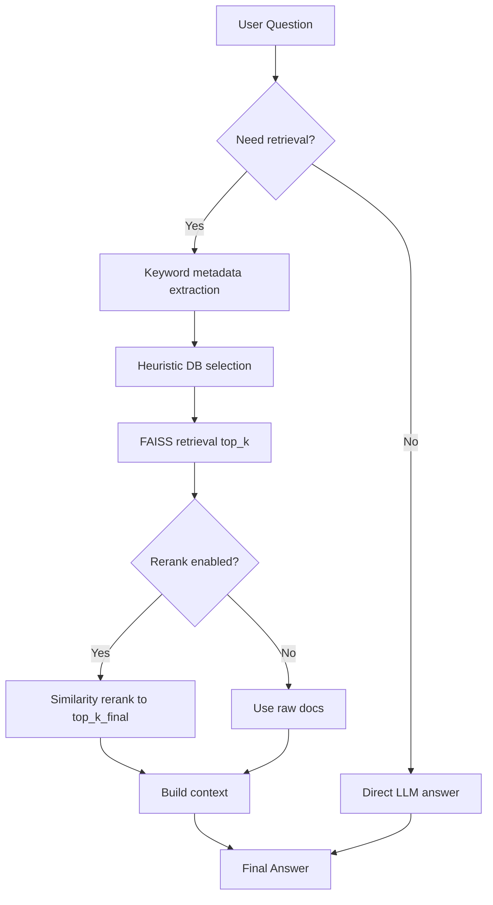
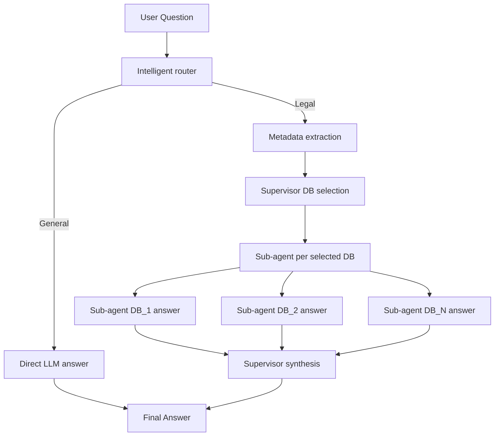
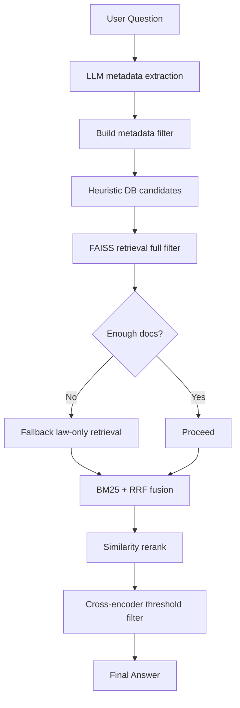
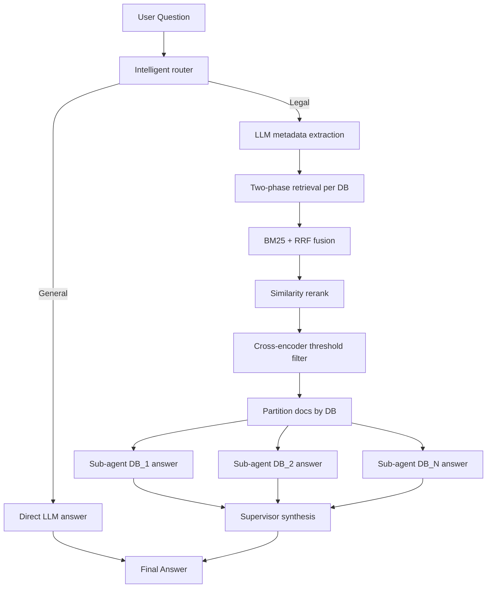

# Legal RAG System

This project implements an agentic Retrieval-Augmented Generation (RAG) pipeline for legal QA across divorce and inheritance domains in Italy, Estonia, and Slovenia.

## 1) Setup and Run

### Environment variables

Create `.env` in project root:

```ini
OPENROUTER_API_KEY=your_key_here
HUGGINGFACEHUB_API_TOKEN=your_key_here
```

### Data layout

Place JSON corpus under `Contest_Data/` with country and domain subfolders.

### Local run

```bash
python -m venv .venv
source .venv/bin/activate
pip install --upgrade pip
pip install -r requirements.txt

# Apple Silicon cleanup (if TF stack was already installed)
pip uninstall -y tensorflow tf-keras keras tensorflow-estimator tensorflow-io-gcs-filesystem

streamlit run Home.py
```

### Docker run

```bash
docker build -t agentic-rag-app .
docker run -p 8501:8501 --env-file .env -v $(pwd)/Contest_Data:/app/Contest_Data agentic-rag-app
```

Open: `http://localhost:8501`

## 2) Architectures Used

| Architecture | Core idea | Best use case |
|---|---|---|
| Single Agent | One retrieval pipeline and one grounded answer call | Low-latency baseline |
| Multi-Agent | Supervisor routes to per-DB sub-agents and synthesizes | Mixed-source legal questions |
| Hybrid (Metadata + Vector) | LLM metadata extraction + FAISS + BM25/RRF + filtering | Retrieval-focused diagnostics |
| Hybrid Multi-Agent | Hybrid retrieval + per-DB sub-agents + supervisor merge | Best overall production mode |

### Component matrix

| Component | Single | Multi | Hybrid | Hybrid Multi-Agent |
|---|---|---|---|---|
| Intelligent router | Optional | Yes | Optional | Yes |
| LLM metadata extraction | No | Partial | Yes | Yes |
| FAISS dense retrieval | Yes | Yes | Yes | Yes |
| BM25 + RRF fusion | No | No | Yes | Yes |
| Similarity rerank | Yes | Yes | Yes | Yes |
| Cross-encoder threshold filter | No | No | Yes | Yes |
| Per-DB sub-agents | No | Yes | No | Yes |
| Supervisor synthesis | No | Yes | No | Yes |

## 3) Updated Aggregated Mean Scores

The following values are the updated aggregate metrics to use in reports.

| Metric | Aggregated Mean Score |
|---|---:|
| context_precision | 0.800 |
| context_recall | 0.833 |
| faithfulness | 0.800 |
| answer_relevancy | 0.822 |
| answer_correctness | 0.621 |

## 4) Metric Explanation Table

| Parameter | What it measures | How to read this value | Current implication |
|---|---|---|---|
| context_precision | Share of retrieved docs that are truly relevant | Higher means less retrieval noise | 0.800 indicates good precision with moderate residual noise |
| context_recall | Share of needed evidence actually retrieved | Higher means better evidence coverage | 0.833 indicates strong coverage of relevant legal evidence |
| faithfulness | Portion of answer claims grounded in retrieved context | Higher means fewer hallucinations | 0.800 indicates mostly grounded responses |
| answer_relevancy | How directly the answer addresses the user query | Higher means more focused answers | 0.822 indicates high topical focus |
| answer_correctness | Agreement with expected/ground-truth answer | Higher means stronger factual alignment | 0.621 indicates moderate correctness and room to improve synthesis |

## 5) Recommended Production Parameters

| Parameter | Recommended value |
|---|---|
| agentic_mode | hybrid_multiagent |
| top_k | 15 |
| top_k_final | 10 |
| use_rerank | true |
| rerank_metric | cosine |
| use_bm25 | true |
| cross_encoder_model | cross-encoder/ms-marco-MiniLM-L-6-v2 |
| cross_encoder_threshold | 0.0 |
| similarity_threshold | 0.45 |
| chunk_size | 512 |
| chunk_overlap | 50 |
| max_context_chars | 8000 |

## 6) Mermaid Process Flow Diagrams

### Single Agent



### Multi-Agent



### Hybrid (Metadata + Vector)



### Hybrid Multi-Agent


