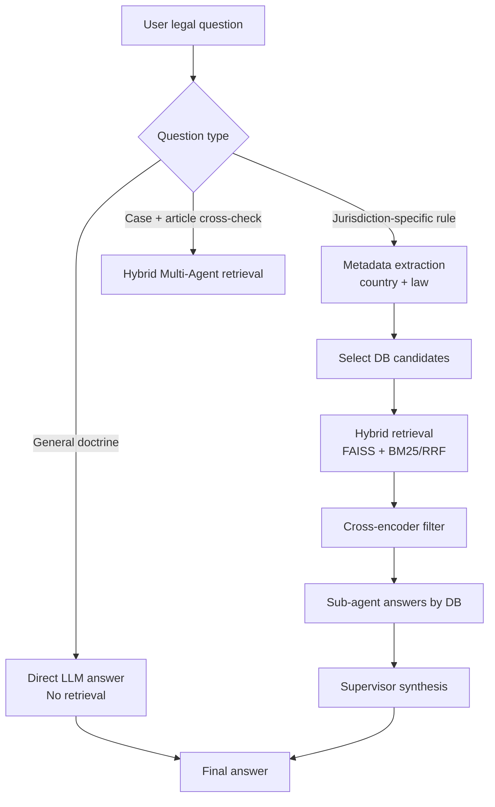

# Anticipated Q/A Set for Legal RAG

This file captures high-probability questions based on the observed sessions in [chat.json](chat.json), with concise reference answers and architecture routing hints.

## Descriptive Q/A (Likely User Intents)

### 1) Estonia joint property during marriage
**Question:** Can I sell my half of marital property while still married under Estonian jointness of property?

**Answer:** Normally no. Under Estonian joint property rules, a spouse cannot unilaterally dispose of an abstract share of joint property while the regime is active. Division is generally handled after termination of the regime, or through a legally valid court process/agreement.

### 2) Change matrimonial regime in Italy
**Question:** What formalities are required to change matrimonial property regime in Italy, and when does it bind third parties?

**Answer:** The agreement should be in the required formal legal instrument (typically public/notarial form for this class of family-property agreements). Third-party effectiveness requires proper registration/publicity in the relevant register.

### 3) Compulsory portion in Estonia succession
**Question:** How large is compulsory portion and what does the heir receive?

**Answer:** The compulsory portion is generally calculated as one-half of what the claimant would have received in intestate succession (subject to statutory conditions). The claim is fundamentally monetary for any deficiency and can be certified in notarial succession practice.

### 4) Indivisible inherited real estate
**Question:** If inherited property cannot be conveniently divided, can court order auction and split proceeds?

**Answer:** Yes, that is a standard remedy in many succession/property division frameworks when in-kind partition is impractical and co-heirs cannot agree. Courts may alternatively allocate the asset to one heir with balancing compensation.

### 5) Estonia vs Slovenia on selling marital share
**Question:** Can spouse sell/gift their share while marriage continues in joint/community regimes?

**Answer:** Usually not unilaterally. The usual model is joint administration or consent-based disposal, with court-supervised division at dissolution or in specific exceptional procedures.

### 6) Separation of assets triggers
**Question:** When can court order judicial separation of assets during marriage?

**Answer:** Typical triggers include serious mismanagement, endangerment of family/property interests, prolonged non-contribution, or other statutory grounds. Court may establish separateness and allocate/offset claims as provided by law.

### 7) Void vs voidable contract
**Question:** What is the difference and legal consequence?

**Answer:** Void acts are treated as legally ineffective from inception; voidable acts are valid until challenged by entitled party, then rescinded with restoration consequences as applicable.

### 8) Non-contractual negligence
**Question:** What must be proved in tort liability?

**Answer:** Core elements are duty, breach, causation, and damages. Jurisdiction-specific variants may refine each element and standards of proof.

### 9) Set-off in marital property disputes
**Question:** Can jointly owned receivables be set off in division litigation?

**Answer:** Set-off can be allowed under specific legal conditions, often where law/agreement permits satisfaction from common assets. Courts can net positions and adjust amounts for fairness and proportionality.

### 10) Database citation mismatch concern
**Question:** Why does answer cite wrong country source sometimes?

**Answer:** Usually due to imperfect routing/metadata filtering or noisy retrieval. The fix is stricter routing, per-DB isolated sub-agents, reranking, and cross-encoder threshold filtering.

---

## Tabular Q/A Bank

| ID | Likely user question | Short answer pattern | Primary legal scope | Suggested retrieval mode |
|---|---|---|---|---|
| Q1 | Can I sell my share of marital assets while still married (Estonia)? | Usually no unilateral disposal in active joint property regime | Estonia, divorce/property | Hybrid Multi-Agent |
| Q2 | How to change matrimonial property regime in Italy? | Public-form agreement + registration for third-party effect | Italy, divorce/property | Hybrid Multi-Agent |
| Q3 | How is compulsory portion computed in Estonia? | Generally half of intestate share; deficiency claim is monetary | Estonia, inheritance | Hybrid Multi-Agent |
| Q4 | If inherited real estate is indivisible, what happens? | Auction or assignment with balancing payment | Italy/Estonia/Slovenia inheritance | Hybrid Multi-Agent |
| Q5 | Estonia vs Slovenia: can spouse gift/sell share during marriage? | Usually requires consent or later division process | Comparative divorce/property | Hybrid Multi-Agent |
| Q6 | Judicial separation of assets: legal triggers? | Mismanagement/endangerment/non-contribution and similar statutory triggers | Slovenia/Italy/Estonia divorce | Hybrid Multi-Agent |
| Q7 | Void vs voidable contract? | Void: ineffective from start; voidable: valid until annulled | General civil law | Direct LLM mode (no retrieval) |
| Q8 | What proves negligence in tort? | Duty, breach, causation, damages | General civil law | Direct LLM mode (no retrieval) |
| Q9 | Can joint receivable be set off in division dispute? | Possible under statutory limits, with court netting adjustments | Estonia, divorce/property | Hybrid Multi-Agent |
| Q10 | Why wrong-country citation appears? | Routing/retrieval noise; improve with stricter selection and reranking | System behavior | N/A (diagnostic) |

---

## Question-Type Routing Diagram

---

## Recommended Serving Defaults for This Q/A Bank

| Parameter | Recommended value |
|---|---|
| agentic_mode | hybrid_multiagent |
| top_k | 15 |
| top_k_final | 10 |
| use_rerank | true |
| rerank_metric | cosine |
| use_bm25 | true |
| cross_encoder_threshold | 0.0 |
