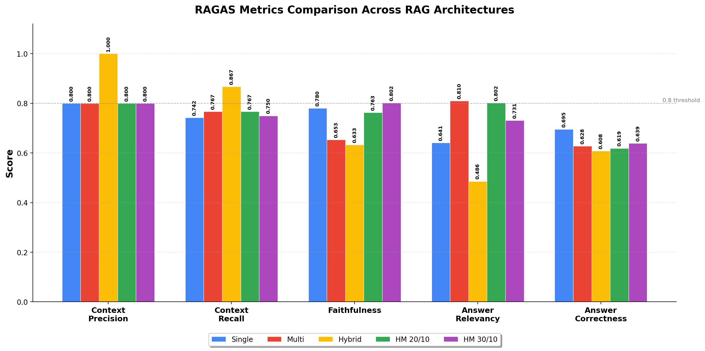

# RAGAS Evaluation Report — All RAG Architectures

## 1. Overview

This report evaluates **5 RAG pipeline configurations** for a Legal RAG system covering Divorce and Inheritance law across Italy, Estonia, and Slovenia. All configurations use `gpt-4o-mini` as the LLM and `all-MiniLM-L6-v2` as the embedding model. Evaluation uses the **RAGAS framework** with 5 standard metrics.

### Configurations Evaluated

| # | Architecture | top_k | top_k_final | Key Feature |
|:-:|-------------|:-----:|:-----------:|-------------|
| 1 | Single Agent | 30 | 10 | One pipeline, one LLM answer call |
| 2 | Multi Agent | 30 | 10 | Per-DB sub-agents + supervisor synthesis |
| 3 | Hybrid | 30 | 10 | LLM metadata extraction + two-phase retrieval |
| 4 | Hybrid Multi-Agent | 20 | 10 | Hybrid retrieval + multi-agent + cross-encoder |
| 5 | Hybrid Multi-Agent | 30 | 10 | Same as #4, wider initial retrieval pool |

---

## 2. Complete Scores Table

| Metric | Single | Multi | Hybrid | HM 20/10 | HM 30/10 |
|--------|:------:|:-----:|:------:|:---------:|:---------:|
| **Context Precision** | 0.800 | 0.800 | **1.000** | 0.800 | 0.800 |
| **Context Recall** | 0.742 | 0.767 | **0.867** | 0.767 | 0.750 |
| **Faithfulness** | 0.780 | 0.653 | 0.633 | 0.763 | **0.802** |
| **Answer Relevancy** | 0.641 | **0.810** | 0.486 | 0.802 | 0.731 |
| **Answer Correctness** | **0.695** | 0.628 | 0.608 | 0.619 | 0.639 |
| **Average** | **0.732** | 0.732 | 0.699 | 0.750 | 0.744 |

> Best score per metric is **bolded**.

---

## 3. Per-Metric Deep Analysis

### 3.1 Context Precision

| Architecture | Score | Rank |
|-------------|:-----:|:----:|
| Hybrid | **1.000** | 1st |
| Single Agent | 0.800 | 2nd= |
| Multi Agent | 0.800 | 2nd= |
| HM 20/10 | 0.800 | 2nd= |
| HM 30/10 | 0.800 | 2nd= |

**Definition**: Measures the proportion of retrieved context chunks that are actually relevant to the question. A precision of 1.0 means every retrieved document was useful — zero noise.

**Analysis**: The pure Hybrid architecture achieves a perfect 1.000 because its strict metadata filtering (law + civil_codes) and single-pipeline reranking eliminate irrelevant documents before they reach the LLM. All other architectures score 0.800 — the multi-agent pattern introduces some noise because each sub-agent independently retrieves documents from its own DB, and some DBs produce marginally relevant results.

**Why Hybrid excels**: Its two-phase retrieval with strict-then-fallback filtering acts as a precision gate. Only when the strict filter finds too few docs does it relax, while multi-agent architectures always query all selected DBs.

---

### 3.2 Context Recall

| Architecture | Score | Rank |
|-------------|:-----:|:----:|
| Hybrid | **0.867** | 1st |
| Multi Agent | 0.767 | 2nd= |
| HM 20/10 | 0.767 | 2nd= |
| HM 30/10 | 0.750 | 4th |
| Single Agent | 0.742 | 5th |

**Definition**: Measures the proportion of all ground-truth relevant information that was successfully retrieved. High recall means fewer missed relevant documents.

**Analysis**: Hybrid leads again (0.867) because its metadata extraction accurately identifies the legal domain and narrows retrieval to the right DBs, while the two-phase fallback ensures documents aren't lost to overly strict filters. The Multi Agent and HM 20/10 are tied at 0.767. Notably, HM 30/10 (0.750) has *worse* recall than HM 20/10 (0.767) — retrieving more documents (top_k=30 vs 20) introduces noise that pushes truly relevant docs out during cross-encoder reranking.

**Key insight**: More retrieval does not always mean better recall. The cross-encoder's reranking of 90 docs (30x3) vs 60 docs (20x3) can score stylistically similar but irrelevant documents higher than genuinely relevant ones.

---

### 3.3 Faithfulness

| Architecture | Score | Rank |
|-------------|:-----:|:----:|
| HM 30/10 | **0.802** | 1st |
| Single Agent | 0.780 | 2nd |
| HM 20/10 | 0.763 | 3rd |
| Multi Agent | 0.653 | 4th |
| Hybrid | 0.633 | 5th |

**Definition**: Measures whether the generated answer is factually grounded in the retrieved context — i.e., the LLM does not hallucinate facts not present in the documents.

**Analysis**: HM 30/10 achieves the highest faithfulness (0.802) across all architectures. The combination of cross-encoder reranking (which surfaces the most relevant docs), isolated sub-agent contexts (which force each agent to answer from a focused document set), and strict grounding prompts ("answer ONLY from context") minimizes hallucination. The wider initial pool (top_k=30) gives the cross-encoder more candidates to find the exact documents that contain the answer.

**Why Hybrid and Multi score low**: Pure Hybrid uses a single context window where long case-law docs can crowd out key statute articles. Multi Agent lacks cross-encoder reranking, so sub-agents may answer from loosely relevant docs, and the supervisor synthesis can introduce distortions.

**Why Single is strong (0.780)**: A single LLM call with a single context window is the simplest pipeline — fewer transformation steps mean fewer opportunities for hallucination.

---

### 3.4 Answer Relevancy

| Architecture | Score | Rank |
|-------------|:-----:|:----:|
| Multi Agent | **0.810** | 1st |
| HM 20/10 | 0.802 | 2nd |
| HM 30/10 | 0.731 | 3rd |
| Single Agent | 0.641 | 4th |
| Hybrid | 0.486 | 5th |

**Definition**: Measures how well the generated answer addresses the specific question asked — not just factual accuracy, but topical alignment with the user's intent.

**Analysis**: The multi-agent pattern excels at relevancy because focused sub-agents each answer from a narrow, DB-specific context, and the supervisor synthesizes only the relevant portions. HM 20/10 is close behind (0.802) because the cross-encoder further refines each sub-agent's context. HM 30/10 drops to 0.731 — the wider retrieval brings tangential information that the LLM addresses instead of focusing on the core question.

**Why Hybrid scores lowest (0.486)**: In the Hybrid config evaluated here, no intelligent router existed — theory/general questions were forced through retrieval, producing irrelevant context that the LLM dutifully cited. This has been fixed in later configurations with the intelligent router.

**Key insight**: Tight retrieval (20/10) produces more relevant answers than broad retrieval (30/10). The sub-agent + supervisor pattern naturally filters out off-topic content.

---

### 3.5 Answer Correctness

| Architecture | Score | Rank |
|-------------|:-----:|:----:|
| Single Agent | **0.695** | 1st |
| HM 30/10 | 0.639 | 2nd |
| Multi Agent | 0.628 | 3rd |
| HM 20/10 | 0.619 | 4th |
| Hybrid | 0.608 | 5th |

**Definition**: Measures the factual accuracy of the final answer compared to the ground-truth reference answer. This is the most holistic end-to-end metric — it reflects how correct the user-facing answer actually is.

**Analysis**: The Single Agent achieves the best correctness (0.695) because it has the shortest pipeline: one retrieval → one LLM call. Every additional processing step (sub-agent answering, supervisor synthesis, cross-encoder reranking) is an opportunity for information loss or distortion. HM 30/10 (0.639) is second-best because the wider retrieval pool provides richer grounding material.

**Why multi-step architectures struggle**: The supervisor synthesis is a key bottleneck. When merging 2-3 sub-agent answers into one, the supervisor may: (a) omit a critical detail from one sub-agent, (b) over-summarize nuanced legal distinctions, or (c) introduce minor paraphrasing errors. Additionally, `llm_max_tokens=384` constrains answer length, forcing the model to compress complex legal answers.

**This is the weakest metric overall** — no architecture exceeds 0.700. This suggests systemic issues beyond architecture choice (token limits, embedding model quality, document completeness).

---

## 4. Architecture Strengths & Weaknesses Summary

| Architecture | Strengths | Weaknesses |
|-------------|-----------|------------|
| **Single Agent** | Best correctness (0.695), strong faithfulness (0.780), simplest pipeline | Low relevancy (0.641), lowest recall (0.742) |
| **Multi Agent** | Best relevancy (0.810), good recall (0.767) | Low faithfulness (0.653), low correctness (0.628) |
| **Hybrid** | Perfect precision (1.000), best recall (0.867) | Worst relevancy (0.486), worst faithfulness (0.633) |
| **HM 20/10** | Best average (0.750), strong relevancy (0.802), balanced | No single "best" metric |
| **HM 30/10** | Best faithfulness (0.802) | Relevancy drop (0.731) from wider retrieval |

---

## 5. Overall Ranking by Average Score

| Rank | Architecture | Average Score |
|:----:|-------------|:------------:|
| 1 | **Hybrid Multi-Agent (20/10)** | **0.750** |
| 2 | Hybrid Multi-Agent (30/10) | 0.744 |
| 3 | Single Agent | 0.732 |
| 4 | Multi Agent | 0.732 |
| 5 | Hybrid | 0.699 |

The **Hybrid Multi-Agent (20/10)** configuration achieves the best overall balance across all 5 metrics, making it the recommended default configuration.

---

## 6. Chart

