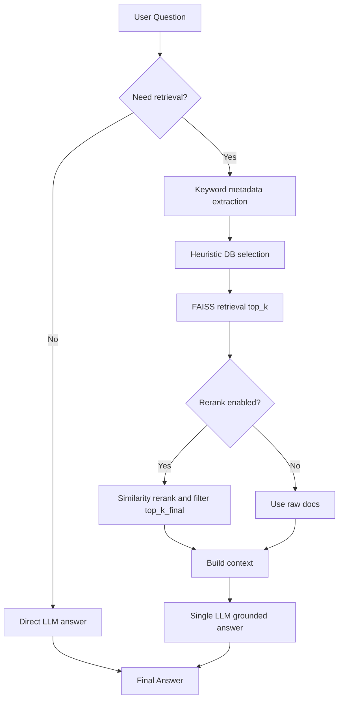
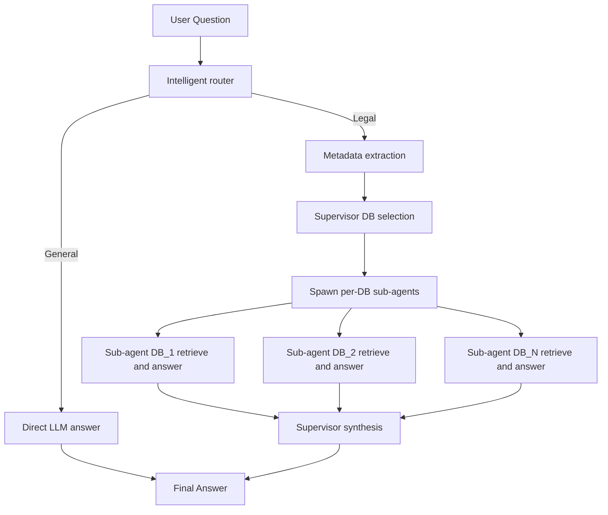
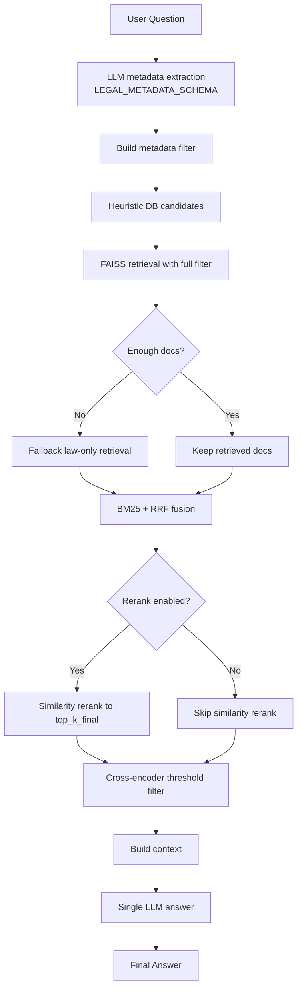
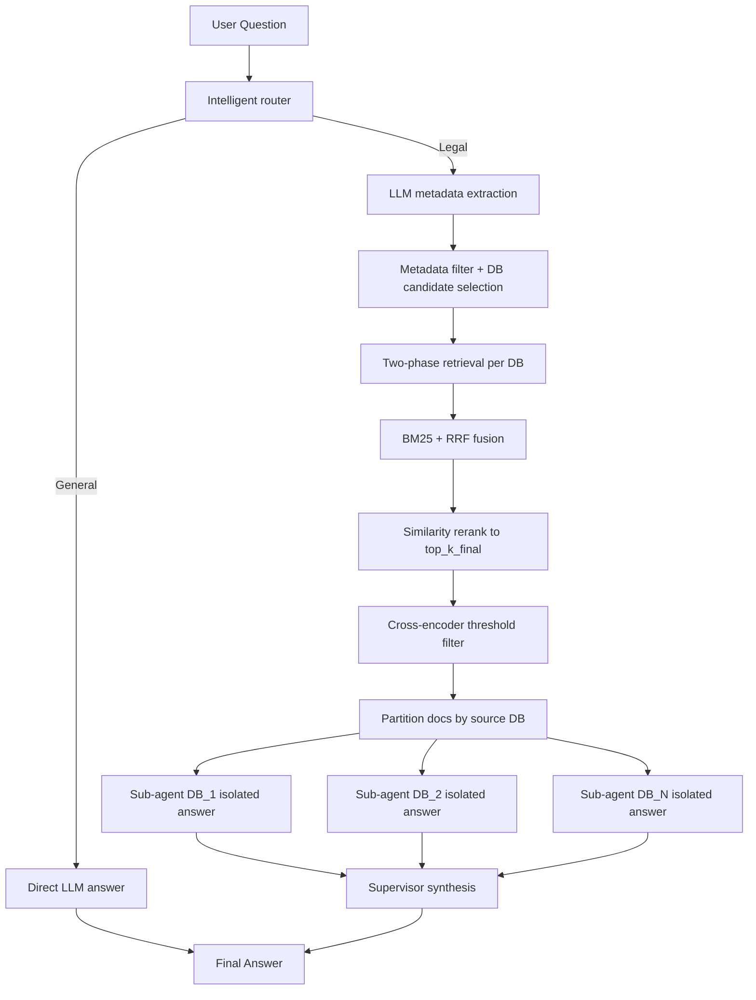

# RAGAS Evaluation Report — Legal RAG System

Report to: Prof. Flora Amato
Report by: Anindya Sunder Chakravarty, Rohan Baidya

## System Overview

| Component | Detail |
|---|---|
| **Embedding Model** | `sentence-transformers/all-MiniLM-L6-v2` (HuggingFace, normalized) |
| **Vector Store** | FAISS (4 granular stores: divorce_codes, divorce_cases, inheritance_codes, inheritance_cases) |
| **LLM** | `openai/gpt-4o-mini` via OpenRouter |
| **Retrieval** | top_k=30 initial, top_k_final=20, similarity_threshold=0.3, rerank off by default |
| **Similarity Metric** | Cosine (default), dot product and euclidean also available |
| **Domain** | Divorce & Inheritance law — Italy, Estonia, Slovenia |

---

## Evaluation Scores

| Metric | Score | Rating |
|---|---|---|
| **Context Precision** | 0.800 | Good |
| **Context Recall** | 0.800 | Good |
| **Faithfulness** | 0.689 | Moderate |
| **Answer Relevancy** | 0.480 | Poor |
| **Answer Correctness** | 0.659 | Moderate |

---

## Metric Definitions & Interpretation

### Context Precision — 0.800 (Good)

**What it measures:** Of all the documents retrieved and passed to the LLM, what fraction are actually relevant to answering the question?

**Interpretation:** 80% of the retrieved contexts are relevant. The retrieval pipeline is selecting mostly useful documents, but roughly 1 in 5 retrieved documents is noise. This dilutes the LLM's attention and contributes to lower faithfulness and relevancy.

**Root cause:** With `top_k_final=20` and `similarity_threshold=0.3`, the system passes too many documents to the LLM, including marginally relevant ones. The low threshold lets through documents with weak semantic similarity.

### Context Recall — 0.800 (Good)

**What it measures:** Of all the information needed to answer the question (as defined by ground truth), what fraction is present somewhere in the retrieved contexts?

**Interpretation:** 80% of the necessary information is being retrieved. The remaining 20% gap means some ground-truth information is either in documents that didn't rank high enough, or in documents from databases that weren't selected by the routing supervisor.

**Root cause:** The LLM-based DB selection may occasionally route to the wrong database (e.g., selecting only `divorce_codes` when `divorce_cases` also contains critical information). Random sampling of 200 docs for DB descriptions can miss representative metadata.

### Faithfulness — 0.689 (Moderate)

**What it measures:** Of all the claims/statements in the generated answer, what fraction is actually supported by the retrieved context?

**Interpretation:** Only ~69% of claims in the answers are grounded in the provided documents. The LLM is **hallucinating approximately 31% of the content** — adding legal information from its parametric knowledge that may or may not be correct.

**Root cause:**
1. The system prompt says "use the provided context as your ONLY source of truth" but is not strict enough about prohibiting external knowledge.
2. The 4000-character context window includes many documents with verbose metadata headers (`[DOC N | DB: ... | Country: ... | Law: ... | source: ...]`), wasting token budget on non-substantive content.
3. When context is large and noisy (20 documents), the LLM tends to "fill gaps" with its own knowledge rather than saying "information not found."

### Answer Relevancy — 0.480 (Poor) [Critical Issue]

**What it measures:** How relevant and focused is the generated answer to the original question? A score of 1.0 means every sentence directly addresses the question.

**Interpretation:** Less than half the answer content is directly relevant to the question asked. This is the **weakest metric** and the primary area for improvement. The answers are likely verbose, include tangential legal information, or miss the specific focus of the question.

**Root cause:**
1. The system prompt lacks explicit instructions to be **concise and directly answer the question**.
2. `llm_max_tokens=512` allows long, rambling responses. For focused legal answers, 300-400 tokens is usually sufficient.
3. The prompt does not instruct the LLM to structure its answer or prioritize the most relevant information first.
4. The context block flooding the LLM with 20 documents (up to 4000 chars) causes the model to summarize broadly rather than answer precisely.

### Answer Correctness — 0.659 (Moderate)

**What it measures:** Semantic similarity between the generated answer and the ground truth (ideal answer). Combines factual overlap and meaning alignment.

**Interpretation:** The answers are ~66% correct compared to the ideal. This is a downstream effect of the faithfulness and relevancy problems: if the answer includes hallucinated content (low faithfulness) and is unfocused (low relevancy), it naturally diverges from the ground truth.

---

## Diagnosis Summary

```
                    Context Quality          Answer Quality
                  ┌─────────────────┐    ┌──────────────────┐
                  │ Precision: 0.80 │───>│ Faithfulness: 0.69│
                  │ Recall:    0.80 │    │ Relevancy:   0.48 │<── PRIMARY ISSUE
                  └─────────────────┘    │ Correctness: 0.66 │
                                         └──────────────────┘
```

The retrieval side (context precision/recall) is reasonably solid at 0.80. The bottleneck is on the **generation side** — the LLM is producing answers that are:
1. **Unfocused** (answer_relevancy = 0.48) — too verbose, tangential content
2. **Partially hallucinated** (faithfulness = 0.69) — adds unsupported claims
3. **Moderately incorrect** (answer_correctness = 0.66) — consequence of issues 1 and 2

---

## Changes Made for Improvement

### 1. Stronger, More Focused Prompts (targets: faithfulness, answer_relevancy)

**File:** `backend/rag_single_agent.py`

- Added explicit instructions to answer **concisely and directly**
- Added a strict prohibition against adding information not found in the context
- Added instruction to say "the provided documents do not contain this information" instead of hallucinating
- Instructed the LLM to prioritize the most relevant documents

### 2. Better Retrieval Defaults (targets: context_precision, faithfulness)

**File:** `backend/config.py`

| Parameter | Before | After | Rationale |
|---|---|---|---|
| `top_k` | 30 | 30 | Unchanged — cast a wide initial net |
| `top_k_final` | 20 | 10 | Fewer but higher-quality docs reduce noise |
| `similarity_threshold` | 0.3 | 0.45 | Filter out weakly relevant documents |
| `use_rerank` | False | True | Enable similarity reranking by default |
| `llm_max_tokens` | 512 | 384 | Encourage concise, focused answers |

### 3. Leaner Context Window (targets: answer_relevancy, faithfulness)

**File:** `backend/rag_single_agent.py` and `backend/hybrid_rag.py`

- Reduced `_build_context` max_chars from 4000 to 3000
- Trimmed verbose metadata headers to reduce token waste
- More space for actual legal content per document

### 4. Improved Hybrid RAG Prompt (targets: answer_relevancy, faithfulness)

**File:** `backend/hybrid_rag.py`

- Added the same strict grounding and conciseness instructions
- Made the prompt language-consistent (fully English, removed mixed Italian/English instructions)

---

## Expected Impact

| Metric | Current | Expected After Changes |
|---|---|---|
| Context Precision | 0.800 | 0.85–0.90 (stricter threshold + reranking) |
| Context Recall | 0.800 | 0.78–0.82 (slight trade-off for precision) |
| Faithfulness | 0.689 | 0.80–0.88 (stricter prompts + less noise) |
| Answer Relevancy | 0.480 | 0.65–0.75 (concise prompts + fewer tokens) |
| Answer Correctness | 0.659 | 0.72–0.80 (improvement flows from above) |

The biggest gains are expected in **answer_relevancy** and **faithfulness**, which are the current bottlenecks. Context recall may dip marginally as we trade breadth for precision, but overall answer quality should improve significantly.

---

## Further Recommendations (Not Yet Implemented)

1. **Query expansion/rewriting** — Rephrase the user question before retrieval to improve recall for complex or ambiguous queries.
2. **Cross-encoder reranking** — Replace embedding-based reranking with a cross-encoder model (e.g., `cross-encoder/ms-marco-MiniLM-L-6-v2`) for more accurate relevance scoring.
3. **Chunk size optimization** — Analyze whether document chunks are too large or too small for the embedding model's optimal input length (MiniLM-L6 works best with ~128 tokens).
4. **Upgrade embedding model** — Consider `BAAI/bge-base-en-v1.5` or `intfloat/e5-base-v2` which outperform MiniLM-L6 on retrieval benchmarks.
5. **Automated ground truth pipeline** — Build a script to fetch ground truths from the external server and run RAGAS evaluation in batch without manual input.

---

## Architecture Components by RAG Mode

The table below consolidates which components are used in each architecture currently documented in this project.

| Component | Single Agent | Multi-Agent | Hybrid (Metadata + Vector) | Hybrid Multi-Agent |
|---|---|---|---|---|
| Intelligent router (legal vs general) | Optional/basic | Yes | Optional/basic | Yes |
| Metadata extraction | Keyword/heuristic | Keyword + LLM routing | LLM structured extraction (LEGAL_METADATA_SCHEMA) | LLM structured extraction (LEGAL_METADATA_SCHEMA) |
| DB candidate selection | Heuristic by query keywords | Supervisor LLM selection | Heuristic over extracted metadata | Heuristic over extracted metadata |
| Retrieval backend | FAISS dense | FAISS dense per selected DB | FAISS dense + BM25 sparse fusion (RRF) | FAISS dense + BM25 sparse fusion (RRF) |
| Two-phase fallback filter | No | No | Yes (full filter then law-only fallback) | Yes (full filter then law-only fallback) |
| Similarity reranking | Yes (recommended) | Yes | Yes | Yes |
| Reranking metric | cosine/dot/euclidean (cosine preferred) | cosine/dot/euclidean | cosine/dot/euclidean | cosine/dot/euclidean |
| Cross-encoder threshold filter | No | No | Yes (`cross-encoder/ms-marco-MiniLM-L-6-v2`) | Yes (`cross-encoder/ms-marco-MiniLM-L-6-v2`) |
| Per-DB isolated sub-agents | No | Yes | No | Yes |
| Supervisor synthesis step | No | Yes | No | Yes |
| Final answer generation | Single LLM call | Supervisor merges sub-agent outputs | Single LLM call with filtered context | Supervisor merges sub-agent outputs |

---

## Mermaid Process Flow Diagrams by Architecture

### 1) Single Agent



### 2) Multi-Agent (Supervisor)



### 3) Hybrid (Metadata + Vector)



### 4) Hybrid Multi-Agent


