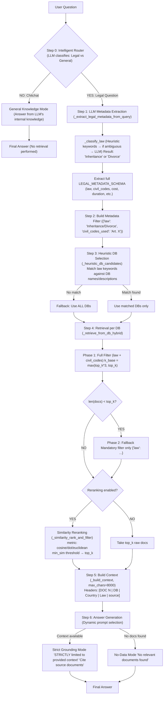

```mermaid
flowchart TD
    Q["User Question"] --> ROUTER{"Step 0: Intelligent Router (LLM classifies: Legal vs General)"}

    ROUTER -- "NO: Chitchat" --> GK["General Knowledge Mode (Answer from LLM's internal knowledge)"]
    GK --> ANS_GK["Final Answer (No retrieval performed)"]

    ROUTER -- "YES: Legal Question" --> META["Step 1: LLM Metadata Extraction (_extract_legal_metadata_from_query)"]

    META --> CLASSIFY["_classify_law (Heuristic keywords → if ambiguous → LLM) Result: 'Inheritance' or 'Divorce'"]
    CLASSIFY --> SCHEMA["Extract full LEGAL_METADATA_SCHEMA (law, civil_codes, cost, duration, etc.)"]
    SCHEMA --> FILTER["Step 2: Build Metadata Filter ({'law': 'Inheritance/Divorce', 'civil_codes_used': 'Art. X'})"]

    FILTER --> HEURISTIC["Step 3: Heuristic DB Selection (_heuristic_db_candidates) Match law keywords against DB names/descriptions"]
    HEURISTIC --> |"No match"| ALL_DB["Fallback: Use ALL DBs"]
    HEURISTIC --> |"Match found"| SEL_DB["Use matched DBs only"]

    ALL_DB --> RETRIEVE
    SEL_DB --> RETRIEVE

    RETRIEVE["Step 4: Retrieval per DB (_retrieve_from_db_hybrid)"]
    RETRIEVE --> FULL["Phase 1: Full Filter (law + civil_codes) k_base = max(top_k*3, top_k)"]
    FULL --> CHECK{"len(docs) < top_k?"}
    CHECK -- "YES" --> FALLBACK_F["Phase 2: Fallback Mandatory filter only {'law': ...}"]
    CHECK -- "NO" --> RERANK
    FALLBACK_F --> RERANK

    RERANK{"Reranking enabled?"}
    RERANK -- "YES" --> SIM["Similarity Reranking (_similarity_rank_and_filter) metric: cosine/dot/euclidean min_sim threshold → top_k"]
    RERANK -- "NO" --> RAW["Take top_k raw docs"]
    SIM --> CTX
    RAW --> CTX

    CTX["Step 5: Build Context (_build_context, max_chars=8000) Headers: [DOC N | DB | Country | Law | source]"]
    CTX --> PROMPT

    PROMPT["Step 6: Answer Generation (Dynamic prompt selection)"]
    PROMPT --> |"Context available"| STRICT["Strict Grounding Mode 'STRICTLY limited to provided context' 'Cite source documents'"]
    PROMPT --> |"No docs found"| NODATA["No-Data Mode 'No relevant documents found'"]
    STRICT --> ANS["Final Answer"]
    NODATA --> ANS
```