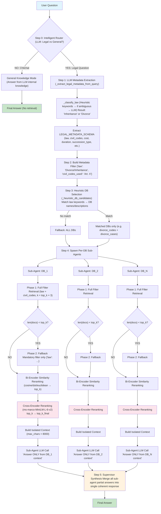

```mermaid
flowchart TD
    Q["User Question"] --> ROUTER{"Step 0: Intelligent Router (LLM: Legal vs General?)"}

    ROUTER -- "NO: Chitchat" --> GK["General Knowledge Mode (Answer from LLM internal knowledge)"]
    GK --> ANS_GK["Final Answer (No retrieval)"]

    ROUTER -- "YES: Legal Question" --> META["Step 1: LLM Metadata Extraction (_extract_legal_metadata_from_query)"]

    META --> CLASSIFY["_classify_law (Heuristic keywords → if ambiguous → LLM) Result: 'Inheritance' or 'Divorce'"]
    CLASSIFY --> SCHEMA["Extract LEGAL_METADATA_SCHEMA (law, civil_codes, cost, duration, succession_type, etc.)"]
    SCHEMA --> FILTER["Step 2: Build Metadata Filter {'law': 'Divorce/Inheritance', 'civil_codes_used': 'Art. X'}"]

    FILTER --> HEURISTIC["Step 3: Heuristic DB Selection (_heuristic_db_candidates) Match law keywords → DB names/descriptions"]
    HEURISTIC --> |"No match"| ALL_DB["Fallback: ALL DBs"]
    HEURISTIC --> |"Match"| SEL_DB["Matched DBs only (e.g. divorce_codes + divorce_cases)"]

    ALL_DB --> SPAWN
    SEL_DB --> SPAWN

    SPAWN["Step 4: Spawn Per-DB Sub-Agents"] --> SA1["Sub-Agent: DB_1"]
    SPAWN --> SA2["Sub-Agent: DB_2"]
    SPAWN --> SAN["Sub-Agent: DB_N"]

    SA1 --> P1["Phase 1: Full Filter Retrieval (law + civil_codes, k = top_k × 3)"]
    SA2 --> P2["Phase 1: Full Filter Retrieval"]
    SAN --> PN["Phase 1: Full Filter Retrieval"]

    P1 --> CHK1{"len(docs) < top_k?"}
    P2 --> CHK2{"len(docs) < top_k?"}
    PN --> CHKN{"len(docs) < top_k?"}

    CHK1 -- "YES" --> FB1["Phase 2: Fallback Mandatory filter only {'law': ...}"]
    CHK1 -- "NO" --> SIM1
    CHK2 -- "YES" --> FB2["Phase 2: Fallback"]
    CHK2 -- "NO" --> SIM2
    CHKN -- "YES" --> FBN["Phase 2: Fallback"]
    CHKN -- "NO" --> SIMN

    FB1 --> SIM1["Bi-Encoder Similarity Reranking (cosine/dot/euclidean → top_k)"]
    FB2 --> SIM2["Bi-Encoder Similarity Reranking"]
    FBN --> SIMN["Bi-Encoder Similarity Reranking"]

    SIM1 --> CE1["Cross-Encoder Reranking (ms-marco-MiniLM-L-6-v2) top_k → top_k_final"]
    SIM2 --> CE2["Cross-Encoder Reranking"]
    SIMN --> CEN["Cross-Encoder Reranking"]

    CE1 --> CTX1["Build Isolated Context (max_chars = 8000)"]
    CE2 --> CTX2["Build Isolated Context"]
    CEN --> CTXN["Build Isolated Context"]

    CTX1 --> LLM1["Sub-Agent LLM Call 'Answer ONLY from DB_1 context'"]
    CTX2 --> LLM2["Sub-Agent LLM Call 'Answer ONLY from DB_2 context'"]
    CTXN --> LLMN["Sub-Agent LLM Call 'Answer ONLY from DB_N context'"]

    LLM1 --> SYNTH["Step 5: Supervisor Synthesis Merge all sub-agent partial answers into single coherent response"]
    LLM2 --> SYNTH
    LLMN --> SYNTH

    SYNTH --> ANS["Final Answer"]

    style Q fill:#e1f5fe
    style ANS fill:#c8e6c9
    style ANS_GK fill:#c8e6c9
    style SYNTH fill:#fff3e0
    style CE1 fill:#fce4ec
    style CE2 fill:#fce4ec
    style CEN fill:#fce4ec
```
