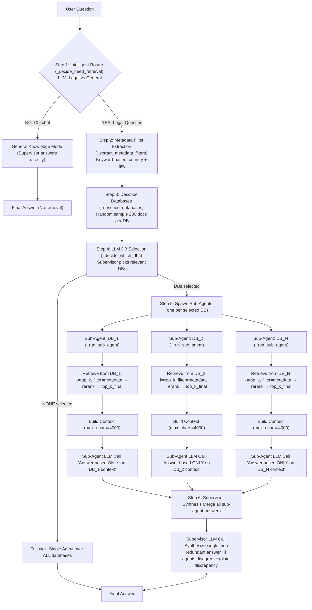

```mermaid
flowchart TD
    Q["User Question"] --> ROUTER{"Step 1: Intelligent Router (_decide_need_retrieval) LLM: Legal vs General"}

    ROUTER -- "NO: Chitchat" --> GK["General Knowledge Mode (Supervisor answers directly)"]
    GK --> ANS_GK["Final Answer (No retrieval)"]

    ROUTER -- "YES: Legal Question" --> FILTERS["Step 2: Metadata Filter Extraction (_extract_metadata_filters) Keyword-based: country + law"]

    FILTERS --> DB_DESC["Step 3: Describe Databases (_describe_databases) Random sample 200 docs per DB"]

    DB_DESC --> DB_SELECT["Step 4: LLM DB Selection (_decide_which_dbs) Supervisor picks relevant DBs"]

    DB_SELECT --> |"NONE selected"| FALLBACK["Fallback: Single Agent over ALL databases"]
    FALLBACK --> ANS

    DB_SELECT --> |"DBs selected"| SPAWN["Step 5: Spawn Sub-Agents (one per selected DB)"]

    SPAWN --> SA1["Sub-Agent: DB_1 (_run_sub_agent)"]
    SPAWN --> SA2["Sub-Agent: DB_2 (_run_sub_agent)"]
    SPAWN --> SA3["Sub-Agent: DB_N (_run_sub_agent)"]

    SA1 --> R1["Retrieve from DB_1 k=top_k, filter=metadata → rerank → top_k_final"]
    SA2 --> R2["Retrieve from DB_2 k=top_k, filter=metadata → rerank → top_k_final"]
    SA3 --> R3["Retrieve from DB_N k=top_k, filter=metadata → rerank → top_k_final"]

    R1 --> C1["Build Context (max_chars=4000)"]
    R2 --> C2["Build Context (max_chars=4000)"]
    R3 --> C3["Build Context (max_chars=4000)"]

    C1 --> A1["Sub-Agent LLM Call 'Answer based ONLY on DB_1 context'"]
    C2 --> A2["Sub-Agent LLM Call 'Answer based ONLY on DB_2 context'"]
    C3 --> A3["Sub-Agent LLM Call 'Answer based ONLY on DB_N context'"]

    A1 --> MERGE["Step 6: Supervisor Synthesis Merge all sub-agent answers"]
    A2 --> MERGE
    A3 --> MERGE

    MERGE --> SYNTH["Supervisor LLM Call 'Synthesize single, non-redundant answer' 'If agents disagree, explain discrepancy'"]

    SYNTH --> ANS["Final Answer"]
```