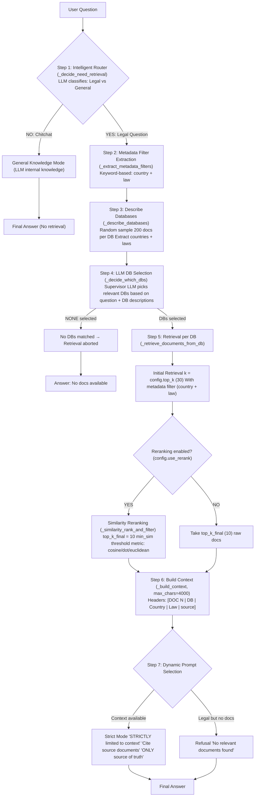

```mermaid
flowchart TD
    Q["User Question"] --> ROUTER{"Step 1: Intelligent Router (_decide_need_retrieval) LLM classifies: Legal vs General"}

    ROUTER -- "NO: Chitchat" --> GK["General Knowledge Mode (LLM internal knowledge)"]
    GK --> ANS_GK["Final Answer (No retrieval)"]

    ROUTER -- "YES: Legal Question" --> FILTERS["Step 2: Metadata Filter Extraction (_extract_metadata_filters) Keyword-based: country + law"]

    FILTERS --> DB_DESC["Step 3: Describe Databases (_describe_databases) Random sample 200 docs per DB Extract countries + laws"]

    DB_DESC --> DB_SELECT["Step 4: LLM DB Selection (_decide_which_dbs) Supervisor LLM picks relevant DBs based on question + DB descriptions"]

    DB_SELECT --> |"NONE selected"| NO_DB["No DBs matched → Retrieval aborted"]
    DB_SELECT --> |"DBs selected"| RETRIEVE

    NO_DB --> ANS_NODATA["Answer: No docs available"]

    RETRIEVE["Step 5: Retrieval per DB (_retrieve_documents_from_db)"]
    RETRIEVE --> INITIAL["Initial Retrieval k = config.top_k (30) With metadata filter (country + law)"]

    INITIAL --> RERANK_CHECK{"Reranking enabled? (config.use_rerank)"}

    RERANK_CHECK -- "YES" --> RERANK["Similarity Reranking (_similarity_rank_and_filter) top_k_final = 10 min_sim threshold metric: cosine/dot/euclidean"]
    RERANK_CHECK -- "NO" --> RAW["Take top_k_final (10) raw docs"]

    RERANK --> CTX["Step 6: Build Context (_build_context, max_chars=4000) Headers: [DOC N | DB | Country | Law | source]"]
    RAW --> CTX

    CTX --> PROMPT{"Step 7: Dynamic Prompt Selection"}

    PROMPT --> |"Context available"| STRICT["Strict Mode 'STRICTLY limited to context' 'Cite source documents' 'ONLY source of truth'"]
    PROMPT --> |"Legal but no docs"| REFUSE["Refusal 'No relevant documents found'"]

    STRICT --> ANS["Final Answer"]
    REFUSE --> ANS
```