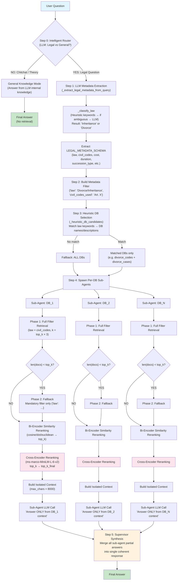

# Hybrid Multi-Agent — Architecture, Metrics Analysis & Improvements

## Pipeline Overview

The Hybrid Multi-Agent combines the **retrieval strengths of the Hybrid pipeline** (LLM metadata extraction, heuristic DB routing, two-phase fallback, similarity reranking) with the **answer-generation strengths of the Multi-Agent architecture** (per-DB sub-agents with isolated context windows, cross-encoder reranking, and supervisor synthesis).

## Step-by-Step Explanation

### Step 0 — Intelligent Router
An LLM call classifies the question as:
- **YES (Legal)**: About Divorce/Inheritance in Italy, Estonia, or Slovenia → proceed to retrieval
- **NO (General)**: Chitchat, legal theory, off-topic → answer from LLM internal knowledge (no retrieval)

### Step 1 — LLM Metadata Extraction
Two-phase classification:
1. **Heuristic keywords**: Check for succession/divorce keywords (fast, no LLM call)
2. **LLM fallback**: If ambiguous, ask the LLM to classify as `Inheritance` or `Divorce`

Then extract a structured metadata JSON conforming to `LEGAL_METADATA_SCHEMA` (law, civil_codes, cost, duration, succession_type, etc.).

### Step 2 — Metadata Filter Construction
Build a FAISS metadata filter from extracted metadata:
- `law` → always applied (mandatory)
- `civil_codes_used` → applied if a specific article is mentioned

### Step 3 — Heuristic DB Selection
Pure string matching (no LLM call) against DB names and descriptions:
- Inheritance → DBs with "inherit", "succession", "eredit" in name
- Divorce → DBs with "divorce", "separat", "separazione" in name
- No match → fallback to ALL DBs

### Step 4 — Per-DB Sub-Agents (Hybrid Retrieval + Cross-Encoder)
For each selected DB, a sub-agent runs independently:
1. **Phase 1**: FAISS retrieval with full metadata filter (`law` + `civil_codes`), k = top_k × 3
2. **Phase 2 (Fallback)**: If too few docs, retry with only mandatory `law` filter
3. **Bi-encoder similarity reranking**: Cosine/dot/euclidean scoring → keep top_k docs
4. **Cross-encoder reranking**: `ms-marco-MiniLM-L-6-v2` jointly encodes (query, doc) pairs → keep top_k_final docs
5. **Build isolated context**: max 8000 chars per sub-agent
6. **Generate partial answer**: LLM grounded strictly in that DB's context

### Step 5 — Supervisor Synthesis
Supervisor LLM merges all sub-agent partial answers:
- Removes redundancy
- Resolves conflicts between sub-agents
- Cites relevant articles/case references
- Produces a single unified answer

---

## Configuration Summary

| Parameter | Value |
|-----------|-------|
| LLM | `openai/gpt-4o-mini` via OpenRouter |
| Embedding | `sentence-transformers/all-MiniLM-L6-v2` (384d) |
| Cross-Encoder | `cross-encoder/ms-marco-MiniLM-L-6-v2` |
| Similarity Metric | Cosine |
| Similarity Threshold | 0.45 |
| Context Window | 8000 chars per sub-agent |
| LLM Temperature | 0.2 |
| LLM Max Tokens | 384 |

---

## Metrics Comparison

### Hybrid Multi-Agent: 20/10 vs 30/10

| Metric | top_k=20, final=10 | top_k=30, final=10 | Delta | Better Config |
|--------|:------------------:|:------------------:|:-----:|:-------------:|
| context_precision | 0.800 | 0.800 | 0.000 | Tied |
| context_recall | **0.767** | 0.750 | +0.017 | 20/10 |
| faithfulness | 0.763 | **0.802** | +0.039 | 30/10 |
| answer_relevancy | **0.802** | 0.731 | -0.071 | 20/10 |
| answer_correctness | 0.619 | **0.639** | +0.020 | 30/10 |

### Cross-Architecture Comparison (all at 30/10 unless noted)

| Metric | Single | Multi | Hybrid | HM 20/10 | HM 30/10 | Best |
|--------|:------:|:-----:|:------:|:---------:|:---------:|:----:|
| context_precision | 0.800 | 0.800 | **1.000** | 0.800 | 0.800 | Hybrid |
| context_recall | 0.742 | 0.767 | **0.867** | 0.767 | 0.750 | Hybrid |
| faithfulness | 0.780 | 0.653 | 0.633 | 0.763 | **0.802** | HM 30/10 |
| answer_relevancy | 0.641 | **0.810** | 0.486 | 0.802 | 0.731 | Multi |
| answer_correctness | **0.695** | 0.628 | 0.608 | 0.619 | 0.639 | Single |

---

## Per-Metric Analysis & Improvement Strategies

### 1. Context Precision (0.800 — both configs)

**What it measures**: Proportion of retrieved context chunks that are actually relevant to answering the question. Higher = less noise in retrieved context.

**Current state**: Dropped from Hybrid's perfect 1.000 to 0.800. The multi-agent architecture queries multiple DBs independently, and some sub-agents retrieve marginally relevant docs.

**Why it dropped**: In pure Hybrid mode, a single retrieval pipeline applies strict metadata filters and a single reranking pass. In Hybrid Multi-Agent, each sub-agent retrieves independently — a sub-agent for `divorce_cases` might retrieve loosely related case law even when the question is specifically about a statute.

**Improvement strategies**:
- **Raise cross-encoder score threshold**: Currently all top_k_final docs are kept regardless of cross-encoder score. Adding a minimum score threshold (e.g., 0.0) would filter out low-confidence documents
- **Better cross-encoder model**: Upgrade from `ms-marco-MiniLM-L-6-v2` to `ms-marco-MiniLM-L-12-v2` or `BAAI/bge-reranker-base` for more accurate relevance scoring
- **Document chunking**: Documents are loaded as complete JSON entries without text splitting. Long documents dilute precision — chunking into smaller focused segments would improve per-chunk relevance

### 2. Context Recall (0.767 / 0.750)

**What it measures**: Proportion of ground-truth relevant information that was successfully retrieved. Higher = fewer missed relevant documents.

**Current state**: Slightly below Multi-Agent (0.767) and notably below Hybrid (0.867). The 30/10 config actually has *worse* recall (0.750) than 20/10 (0.767), suggesting that retrieving more initial docs (30 vs 20) introduces noise that pushes truly relevant docs out during reranking.

**Why 30/10 has lower recall than 20/10**: With top_k=30, the bi-encoder retrieves 90 docs (3× top_k). The cross-encoder then compresses to 10. With more noise in the initial 90 docs, the cross-encoder may score irrelevant-but-stylistically-similar docs higher than truly relevant ones.

**Improvement strategies**:
- **Multi-query retrieval**: Generate 2-3 paraphrases of the user question and retrieve for each, then deduplicate. This dramatically improves recall by catching different phrasings
- **Upgrade embedding model**: `all-MiniLM-L6-v2` (384d) is lightweight but limited. Upgrading to `BAAI/bge-base-en-v1.5` (768d) or `all-mpnet-base-v2` (768d) would improve semantic matching
- **Add BM25 for true hybrid search**: Current "hybrid" uses metadata filtering + vector search. Adding BM25 lexical search and fusing results (Reciprocal Rank Fusion) would catch keyword-exact matches that semantic search misses
- **Expand keyword list in `_classify_law`**: Add more domain-specific terms like "compulsory portion", "heir", "estate", "alimony", "custody" for better law classification and routing

### 3. Faithfulness (0.763 / 0.802)

**What it measures**: Whether the generated answer is factually grounded in the retrieved context (no hallucination). Higher = more faithful to retrieved documents.

**Current state**: Best among all architectures at 30/10 (0.802). The Hybrid Multi-Agent's strict grounding prompts and isolated sub-agent contexts produce highly faithful answers. The 30/10 config is better because more initial retrieval provides richer context for the LLM to ground its answers.

**Why 30/10 is more faithful**: With more docs retrieved initially (30 vs 20), the cross-encoder has a larger pool to select from, so the final 10 docs are more likely to contain the specific facts needed. This gives the LLM enough grounding material to avoid hallucination.

**Improvement strategies**:
- **Increase `llm_max_tokens`**: Currently capped at 384 tokens. When answers are truncated, the model may rush to conclusions or omit citations. Raising to 512-768 allows more complete, well-cited answers
- **Add citation verification prompt**: After generating the answer, run a second LLM pass to verify each claim against the context
- **Structured output for citations**: Require the LLM to output `[Source: DOC N]` for each claim, making hallucination more obvious and penalized

### 4. Answer Relevancy (0.802 / 0.731)

**What it measures**: How well the generated answer addresses the specific question asked (not just accuracy, but topical relevance). Higher = answer directly addresses what was asked.

**Current state**: 20/10 achieves 0.802 (near-best, close to Multi's 0.810), but 30/10 drops to 0.731. The 20/10 config produces more focused answers because the initial retrieval is tighter.

**Why 20/10 is more relevant than 30/10**: With top_k=20, sub-agents retrieve a focused set. The cross-encoder refines to 10 highly relevant docs. With top_k=30, more tangential docs enter the context, and the LLM may address tangential information instead of focusing on the core question.

**Improvement strategies**:
- **Optimize top_k**: The 20/10 config already outperforms 30/10 on relevancy. Consider testing top_k=15 or top_k=25 with final=10 to find the sweet spot
- **Question-focused prompting**: Add explicit instruction to the sub-agent prompt: "Focus your answer ONLY on what the user specifically asked. Do not provide background information unless directly relevant."
- **Post-generation relevancy filter**: Add a lightweight LLM pass that scores the answer's relevancy to the question and rewrites if below threshold
- **Reduce supervisor verbosity**: The synthesis step can introduce tangential information from sub-agents. Tighten the supervisor prompt to prioritize conciseness over comprehensiveness

### 5. Answer Correctness (0.619 / 0.639)

**What it measures**: Factual accuracy of the final answer compared to the ground-truth reference answer. This is the most holistic metric — it reflects the entire pipeline's end-to-end quality.

**Current state**: Lowest across all architectures (Single achieves 0.695). The multi-step generation (sub-agents → supervisor synthesis) introduces information loss and potential distortion.

**Why it's the weakest metric**: 
1. **Synthesis distortion**: The supervisor merges multiple sub-agent answers, and this merging can lose nuance or introduce subtle inaccuracies
2. **Token limit**: With `llm_max_tokens=384`, complex legal answers get truncated mid-sentence
3. **Information loss cascade**: query → metadata extraction → DB selection → retrieval → reranking → cross-encoder → context truncation → sub-agent answer → supervisor synthesis. Each step can lose information

**Improvement strategies**:
- **Increase `llm_max_tokens` to 512-768**: Allows more complete answers with proper citations
- **Pass retrieved documents directly to supervisor**: Instead of only passing sub-agent text answers, also pass the top-scoring documents so the supervisor can verify claims
- **Reduce pipeline depth**: For simple questions (single jurisdiction, single law type), skip the multi-agent architecture entirely and use the simpler Hybrid pipeline
- **Better LLM model**: `gpt-4o-mini` is cost-effective but limited. For correctness-critical applications, using `gpt-4o` or `claude-3.5-sonnet` would significantly improve answer quality
- **Self-consistency sampling**: Generate 3 answers with temperature > 0 and pick the majority consensus answer

---

## Summary: Optimal Configuration

| Goal | Recommended Config | Rationale |
|------|-------------------|-----------|
| Highest faithfulness | **30/10** | More initial docs → richer grounding for LLM |
| Highest answer relevancy | **20/10** | Tighter retrieval → focused answers |
| Balanced performance | **20/10** | Wins on 2/5 metrics, near-tied on rest |
| Highest correctness | Neither — Single agent is best | Multi-step synthesis hurts correctness |

## Priority Improvements (Ranked by Impact)

| Priority | Improvement | Expected Impact | Effort |
|:--------:|-------------|-----------------|:------:|
| 1 | Increase `llm_max_tokens` to 512 | +correctness, +faithfulness | Low |
| 2 | Multi-query retrieval (2-3 paraphrases) | +context_recall | Medium |
| 3 | Cross-encoder score threshold filtering | +context_precision | Low |
| 4 | Upgrade embedding model to `bge-base-en-v1.5` | +recall, +precision | Medium |
| 5 | Tighten sub-agent + supervisor prompts | +answer_relevancy | Low |
| 6 | Add BM25 + Reciprocal Rank Fusion | +context_recall | High |
| 7 | Adaptive pipeline routing (simple → Hybrid, complex → HM) | +correctness | High |
