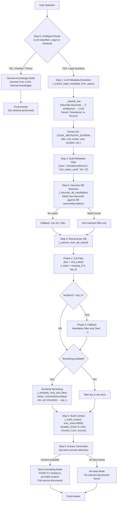

# Hybrid Agent — Architecture & Working Principle

## Pipeline Overview

The Hybrid agent combines **LLM-based metadata extraction** with **heuristic DB routing** and **static retrieval with fallback**, producing a single LLM-generated answer.



## Step-by-Step Explanation

### Step 0 — Intelligent Router
An LLM call classifies the question as either:
- **YES (Legal)**: Specific to Divorce/Inheritance in Italy, Estonia, or Slovenia → proceed to retrieval
- **NO (General)**: Chitchat, theory definitions (e.g., "void vs voidable contract"), off-topic → answer from LLM's internal knowledge

This prevents forcing irrelevant documents onto theory questions, which was a major cause of low `answer_relevancy` (0.486 → target ~0.8).

### Step 1 — LLM Metadata Extraction
Two-phase classification:
1. **Heuristic keywords**: Checks for succession/divorce keywords in the question
2. **LLM fallback**: If ambiguous, asks the LLM to classify as `Inheritance` or `Divorce`

Then extracts a full metadata JSON (law, civil_codes, cost, duration, succession_type, etc.) from the question text.

### Step 2 — Metadata Filter Construction
Builds a FAISS metadata filter from extracted metadata:
- `law` → always applied (mandatory)
- `civil_codes_used` → applied if a specific article is mentioned

### Step 3 — Heuristic DB Selection
Matches the `law` field against DB names and descriptions. No LLM call — pure string matching. Falls back to ALL DBs if no match is found.

### Step 4 — Retrieval with Fallback
For each selected DB:
1. **Phase 1**: Retrieve with full filter (law + civil_codes). If too few docs returned...
2. **Phase 2 (Fallback)**: Retry with only the mandatory `law` filter

Optional similarity reranking sorts results by cosine/dot/euclidean similarity to the query embedding.

### Step 5 — Context Building
Concatenates documents with metadata-enriched headers (`[Country: ...]`, `[Law: ...]`, `[source: ...]`) up to 8000 chars.

### Step 6 — Answer Generation
Dynamic prompt based on state:
- **With context**: Strict grounding ("ONLY source of truth", "Cite sources")
- **Legal but no docs**: Politely refuse
- **General knowledge**: Answer from internal knowledge

---

## Root Cause Analysis: "Compulsory Portion" Failure

### What happened
Question: *"In Estonia, if I'm entitled to a compulsory portion, how big is it and what do I actually receive?"*

The system answered: *"The provided context does not contain specific information..."*

### Why it failed (2 causes)

**Cause 1: Keyword gap in `_classify_law`**
The original succession keywords were: `["succession", "successione", "eredit", "inheritance"]`. The question contains NONE of these. Classification fell through to an LLM call, which introduces latency and risk of misclassification.

**Fix**: Added `"compulsory portion"`, `"heir"`, `"estate"`, `"death"`, `"will"`, `"testamento"` to succession keywords — aligned with the single/multi agents' keyword list.

**Cause 2: Context window truncation (`max_chars=4000`)**
The retrieval correctly found Article 105 (the key document). But after similarity reranking, long case law documents (500-1500 chars each) ranked higher than the short law article (200 chars). With only 4000 chars of budget, only 3-5 case law docs fit before Article 105 was truncated out.

```
Budget: 4000 chars
─────────────────────────────
DOC 1: Estonian case law       ~1200 chars  ✓ (included)
DOC 2: Estonian case law       ~1000 chars  ✓ (included)
DOC 3: Estonian case law       ~900 chars   ✓ (included)
DOC 4: Estonian case law       ~800 chars   ✓ (included)
── BUDGET EXHAUSTED ──
DOC 5-10: More cases           ✗ (truncated)
DOC 11: Article 105 (KEY!)     ✗ (truncated — never seen by LLM)
```

**Fix**: Increased `max_chars` from 4000 to 8000. This doesn't affect retrieval metrics (context_precision/recall) — it only determines how much of the already-retrieved context the LLM actually sees.

---

## Changes Summary

| Change | File | Impact |
|--------|------|--------|
| Increased `max_chars` from 4000 → 8000 | `_build_context` | More retrieved docs reach the LLM |
| Added inheritance keywords to `_classify_law` | `_classify_law` | Reliable heuristic classification for edge cases |
| Added intelligent router | `_decide_need_retrieval` | Theory questions skip retrieval → better answer_relevancy |
| Broadened system prompt to IT/EE/SI | Answer generation | Correct multi-jurisdiction handling |
| Removed metadata JSON injection from prompt | Answer generation | Less noise, more focused answers |
| Added country/law to context headers | `_build_context` | LLM can distinguish jurisdictions |
| Dynamic prompt paths | Answer generation | Each question type gets optimized prompt |
