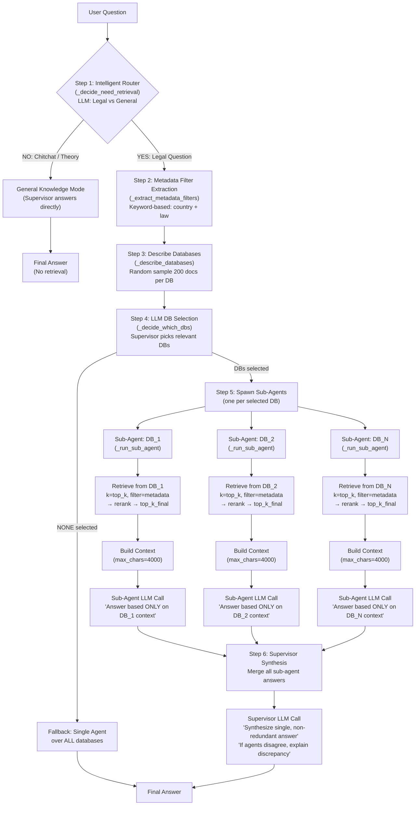

# Multi-Agent — Architecture & Working Principle

## Pipeline Overview

The Multi-agent system uses a **supervisor-subordinate architecture**: the supervisor routes the question to specialized sub-agents (one per DB), each sub-agent retrieves and answers independently, then the supervisor synthesizes a single final answer.

## Step-by-Step Explanation

### Step 1 — Intelligent Router
Identical to single agent. LLM classifies the question:
- **YES**: Legal, jurisdiction-specific → proceed to multi-agent retrieval
- **NO**: Chitchat/theory → supervisor answers directly from internal knowledge

### Step 2 — Metadata Filter Extraction
Same keyword-based heuristic as single agent (`_extract_metadata_filters`). Extracts country and law filters.

### Step 3 — Database Description
Random-samples 200 docs per DB to build descriptions with countries, laws, and content types.

### Step 4 — LLM DB Selection
Supervisor LLM reads the question + DB descriptions and selects which DBs to query. If no DBs are selected, falls back to single-agent mode over ALL databases.

### Step 5 — Sub-Agent Execution (per DB)
For each selected DB, a sub-agent independently:
1. **Retrieves** documents using FAISS with metadata filters
2. **Reranks** by similarity (if enabled) to `top_k_final` docs
3. **Builds context** (max 4000 chars per sub-agent)
4. **Generates a partial answer** via LLM, grounded strictly in that DB's context

Each sub-agent has its own LLM backend instance and sees only its own DB's documents.

### Step 6 — Supervisor Synthesis
The supervisor receives ALL sub-agent partial answers and synthesizes a single final answer:
- Removes redundancy across sub-agents
- If agents disagree, explains the discrepancy
- Produces a unified response as if from a single assistant

---

## Key Differentiators

| Aspect | Multi-Agent | Single Agent | Hybrid |
|--------|------------|--------------|--------|
| Architecture | Supervisor + sub-agents | Single pipeline | Single pipeline |
| Retrieval scope | Per-DB (isolated) | All selected DBs (merged) | All selected DBs (merged) |
| LLM calls | 1 (router) + 1 (DB select) + N (sub-agents) + 1 (synthesis) | 1 (router) + 1 (DB select) + 1 (answer) | 1 (router) + 1 (metadata) + 1 (answer) |
| Fallback | Single agent over all DBs | None | Mandatory filter only |
| Answer synthesis | Supervisor merges multiple perspectives | Direct from single context | Direct from single context |

## Why Multi-Agent Has the Highest answer_relevancy (0.810)

1. **Focused sub-agents**: Each sub-agent answers from a narrow, DB-specific context (e.g., only divorce codes, or only Estonian cases). This produces highly targeted partial answers.

2. **Synthesis removes noise**: The supervisor merges only the relevant parts of each sub-agent answer, producing a clean, non-redundant final response.

3. **No context truncation across DBs**: Each sub-agent gets its own 4000-char context window. With 3 sub-agents, the effective total context is ~12000 chars vs single/hybrid's single 4000-8000 window.

4. **Multiple perspectives**: If a question spans jurisdictions (e.g., "Estonia vs Slovenia"), different sub-agents provide jurisdiction-specific answers that the supervisor merges correctly.

## Metrics Performance

| Metric | Score | Analysis |
|--------|-------|----------|
| context_precision | 0.800 | Good — LLM DB selection + per-DB retrieval |
| context_recall | 0.767 | Moderate — no fallback when per-DB retrieval misses docs |
| faithfulness | 0.653 | Moderate — synthesis step can introduce minor distortions |
| answer_relevancy | **0.810** | Best — focused sub-agents + synthesis removes tangential content |
| answer_correctness | 0.628 | Moderate — synthesis can slightly distort sub-agent facts |
