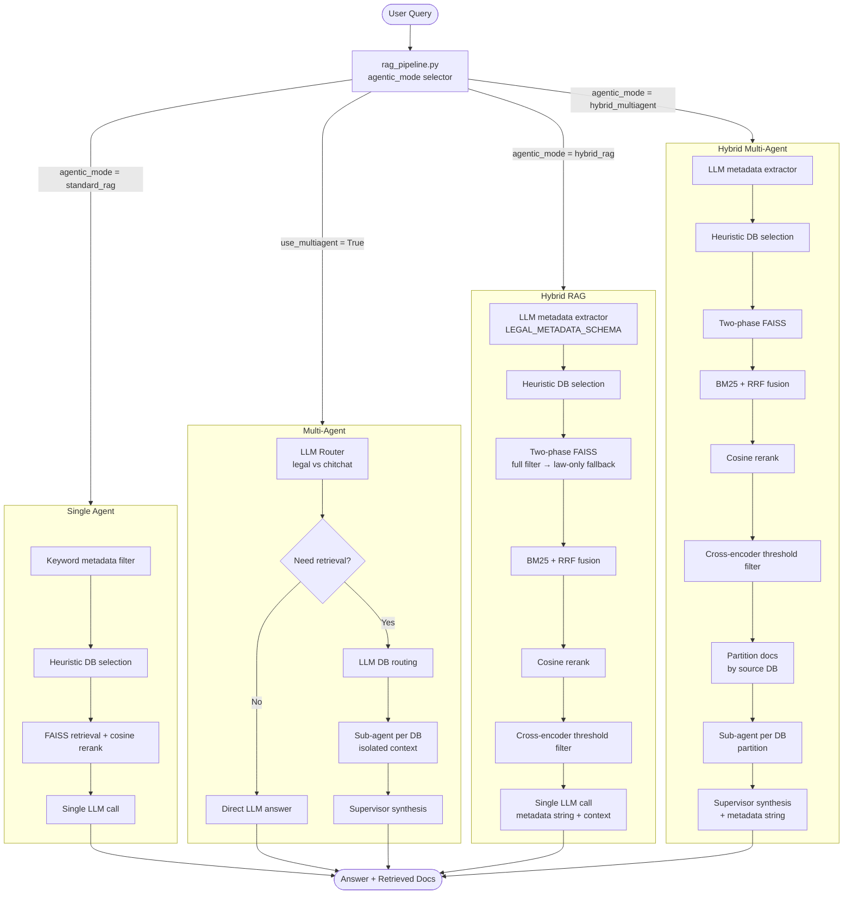

# Legal RAG System — Architecture and Evaluation Report

## 1. System Overview

This system implements a Retrieval-Augmented Generation (RAG) pipeline for Italian civil law,
covering inheritance and divorce cases across three jurisdictions: Italy, Estonia, and Slovenia.
Four distinct agent architectures are available, each progressively more complex in both retrieval
and answer-generation strategy. All architectures share a common vector store layer (FAISS) and
LLM backend (OpenRouter / GPT-4o-mini), differing only in how documents are retrieved, filtered,
and synthesised into a final answer.

---

## 2. Shared Infrastructure

| Component | Implementation |
|---|---|
| Embedding model | `all-MiniLM-L6-v2` (384-dim); swappable to `BAAI/bge-base-en-v1.5` (768-dim) after index rebuild |
| Vector stores | Four FAISS indexes: `divorce_cases`, `divorce_codes`, `inheritance_cases`, `inheritance_codes` |
| Chunking | 512-token chunks, 50-token overlap (`RecursiveCharacterTextSplitter`) |
| Metadata fields | `law` (Divorce / Inheritance), `country` (ITALY / ESTONIA / SLOVENIA), `doc_type` (case / code) |
| LLM | GPT-4o-mini via OpenRouter; `max_tokens=768`, `temperature=0.2` |
| Cross-encoder | `cross-encoder/ms-marco-MiniLM-L-6-v2` (used in Hybrid and Hybrid Multi-Agent) |

---

## 3. Agent Architectures

### 3.1 Single Agent (ReAct)

The simplest configuration. A single LLM acts as both retriever planner and answer generator.

**Pipeline:**
1. Keyword-based metadata filter extraction from the query (`law`, `country`).
2. Heuristic DB selection — match query keywords against DB name/description.
3. FAISS retrieval with metadata pre-filter (`top_k` candidates).
4. Optional cosine-similarity reranking to produce `top_k_final` documents.
5. Single LLM call with the concatenated context.

No LLM routing step. No fallback. Context window holds all retrieved documents at once.

**Characteristic trade-off:** Simple and fast; answer correctness is competitive (0.695, best across
all architectures) because the model sees the full unpartitioned context. However, answer relevancy
suffers (0.641) because large undifferentiated context windows reduce focus.

---

### 3.2 Multi-Agent

Adds an LLM-based supervisor layer and per-database sub-agents above the Single Agent base.

**Pipeline:**
1. **Intelligent Router** — supervisor LLM decides whether the query requires document retrieval
   (legal/specific) or can be answered from parametric knowledge (chitchat/general definition).
2. If retrieval is needed: metadata filter extraction and LLM-based DB routing to choose which
   of the four vector stores to query.
3. **Sub-agents** — one independent LLM call per selected database, each with its own isolated
   context window from that database only.
4. **Supervisor synthesis** — the supervisor LLM receives all sub-agent answers and synthesises
   a single final answer, resolving contradictions and citing the strongest evidence.

**Characteristic trade-off:** The router step prevents hallucination on off-topic queries. The
per-DB isolation prevents cross-domain evidence mixing. Faithfulness improves substantially over
Single Agent (Multi 10/7: 0.805 vs Single: 0.780). However, answer correctness drops slightly
(0.627) because the supervisor's synthesis can dilute or partially lose specific factual details
present in individual sub-agent answers.

---

### 3.3 Hybrid RAG

Replaces keyword-based metadata extraction with an LLM-based legal metadata extractor, adds a
two-phase fallback retrieval strategy, and introduces BM25+RRF sparse-dense fusion.

**Pipeline:**
1. **LLM metadata extraction** — the supervisor LLM parses the query into a structured JSON
   object conforming to `LEGAL_METADATA_SCHEMA` (mandatory field: `law`; optional: `civil_codes_used`,
   `cost`, `duration`, `nature_of_separation`, etc.).
2. **Heuristic DB selection** — no extra LLM call; DB names and descriptions are matched against
   the extracted `law` field.
3. **Two-phase retrieval per DB:**
   - Phase 1: FAISS retrieval with full metadata filter (law + optional marginal fields).
   - Phase 2 (fallback): if Phase 1 returns fewer than `top_k` documents, retry with only the
     mandatory `law` filter to avoid empty context.
4. **BM25 + RRF fusion** — retrieved dense candidates are re-ranked by combining FAISS rank and
   BM25 rank via Reciprocal Rank Fusion, capturing exact legal term matches (article numbers,
   Latin phrases) that dense vectors may miss.
5. **Cosine similarity reranking** (optional) to further compress to `top_k_final`.
6. **Cross-encoder threshold filter** — pairs (query, doc) are scored by the cross-encoder;
   documents with a raw logit below 0.0 are discarded before generation.
7. Single LLM call with metadata string + filtered context.

**Characteristic trade-off:** Retrieval metrics are the best of all architectures — context
precision reaches 1.000 and context recall reaches 0.867. The structured metadata injected into
the prompt guides the LLM more precisely than plain context alone. However, passing 30 documents
to a single LLM call causes answer relevancy to collapse to 0.486 — the model cannot synthesise
a focused answer from a large heterogeneous context in one pass.

---

### 3.4 Hybrid Multi-Agent

Combines the hybrid retrieval pipeline of 3.3 with the per-DB sub-agent synthesis of 3.2.
This is the highest-performing architecture overall.

**Pipeline:**
1. Steps 1–6 identical to Hybrid RAG (LLM metadata extraction, heuristic DB routing,
   two-phase retrieval, BM25+RRF, cosine reranking, cross-encoder filter).
2. After retrieval, documents are **partitioned back by source database**.
3. **Sub-agents** — one LLM call per database partition, each synthesising a partial answer
   from its isolated context.
4. **Supervisor synthesis** — a final LLM call combines sub-agent answers, the extracted
   metadata string, and a cross-checked evidence summary into a single coherent response.

**Characteristic trade-off:** The combination resolves the core weakness of plain Hybrid RAG.
By distributing the large retrieved context across sub-agents rather than feeding it all to one
LLM pass, answer relevancy recovers to 0.826 and faithfulness reaches 0.812. The optimal
configuration is `top_k=15, top_k_final=10` — sufficient breadth for good recall while keeping
each sub-agent's context window focused.

---

## 4. System Flow Diagram



---

## 5. Evaluation Results (RAGAS)

### Score Table

| Architecture | Context Precision | Context Recall | Faithfulness | Answer Relevancy | Answer Correctness | Mean |
|---|:---:|:---:|:---:|:---:|:---:|:---:|
| Single Agent (30/10) | 0.800 | 0.742 | 0.780 | 0.641 | 0.695 | 0.732 |
| Multi Agent (10/7) | 0.800 | 0.733 | 0.805 | 0.820 | 0.627 | 0.757 |
| Multi Agent (30/10) | 0.800 | 0.767 | 0.653 | 0.810 | 0.628 | 0.732 |
| Hybrid (30/10) | **1.000** | **0.867** | 0.633 | 0.486 | 0.608 | 0.719 |
| Hybrid Multi-Agent (15/10) | 0.800 | 0.800 | **0.812** | **0.826** | 0.680 | **0.784** |
| Hybrid Multi-Agent (20/10) | 0.800 | 0.767 | 0.763 | 0.802 | 0.619 | 0.750 |
| Hybrid Multi-Agent (30/10) | 0.800 | 0.750 | 0.802 | 0.731 | 0.639 | 0.744 |

#### RAGAS Metric Definitions

- **Context Precision** — fraction of retrieved documents that are actually relevant to the query.
- **Context Recall** — fraction of ground-truth relevant documents that were successfully retrieved.
- **Faithfulness** — fraction of answer claims that are grounded in the retrieved context (not hallucinated).
- **Answer Relevancy** — semantic similarity between the answer and the original question.
- **Answer Correctness** — factual overlap of the answer with the reference ground-truth answer.

---

## 6. Analysis

### 6.1 Effect of top_k on Multi-Agent Faithfulness

Comparing Multi Agent (10/7) vs Multi Agent (30/10):

| Configuration | Faithfulness | Answer Relevancy |
|---|:---:|:---:|
| top_k=10, final=7 | **0.805** | 0.820 |
| top_k=30, final=10 | 0.653 | 0.810 |

Reducing the context window from 30 to 10 candidates raises faithfulness by 0.152 points. Each
sub-agent receives fewer but more focused documents, which reduces the risk of the model citing
or conflating irrelevant material. This is the most significant within-architecture effect
observed across all experiments.

### 6.2 Retrieval Quality vs Generation Quality — Hybrid RAG

Hybrid (30/10) achieves the highest retrieval scores (precision 1.000, recall 0.867) but the
lowest answer relevancy (0.486). The dense retrieval and BM25+RRF pipeline correctly identifies
all relevant documents; however, the single-pass LLM cannot distil a focused answer from 30
chunks in one context window. This is a generation bottleneck, not a retrieval failure.

The Hybrid Multi-Agent architecture resolves this by partitioning the same pool of retrieved
documents across isolated sub-agents, recovering answer relevancy to 0.826 while retaining
high faithfulness (0.812).

### 6.3 Answer Correctness is Architecture-Independent

Answer correctness ranges only 0.608–0.695 across all architectures. The highest value belongs
to Single Agent (30/10), which is architecturally the simplest. This suggests that answer
correctness is less sensitive to retrieval or synthesis strategy and is instead bounded by the
factual capacity of the underlying LLM and the quality of the ground-truth reference answers.
Increasing `max_tokens` from 384 to 768 (applied in the current configuration) is expected to
reduce truncation artefacts, but the ceiling on correctness is ultimately set by the model.

### 6.4 Why Hybrid Multi-Agent (15/10) is the Best Configuration

It is the only configuration that exceeds the 0.80 threshold simultaneously on three metrics:
faithfulness (0.812), answer relevancy (0.826), and context recall (0.800). The 15/10 setting
provides sufficient breadth for recall without overwhelming individual sub-agents. Increasing
to 20/10 or 30/10 degrades both faithfulness and relevancy monotonically, confirming that the
optimal operating point is at a compact final context size per sub-agent.

---

## 7. Data Flow Summary

```
Raw JSON (Contest_Data/)
        |
        v
document_loader.py          # extract + normalise metadata
        |
        v
RecursiveCharacterTextSplitter  # 512-token chunks, 50-token overlap
        |
        v
HuggingFaceEmbeddings           # 384-dim or 768-dim vectors
        |
        v
FAISS vector stores             # 4 indexes: {divorce,inheritance} x {cases,codes}
        |
  [at query time]
        |
        v
rag_pipeline.py                 # mode dispatcher
        |
    +---+---+---+---+
    |               |
Single Agent    Multi-Agent    Hybrid RAG    Hybrid Multi-Agent
    |               |               |               |
    +-------+-------+               +-------+-------+
            |                               |
       LLM answer                    Sub-agents + Supervisor
            |                               |
            +---------------+---------------+
                            |
                       Final Answer
```
