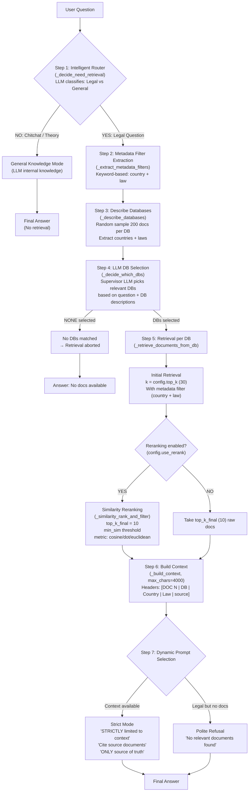

# Single Agent — Architecture & Working Principle

## Pipeline Overview

The Single agent uses a **single LLM pipeline** with an intelligent router, LLM-based DB selection, keyword metadata filters, optional similarity reranking, and a dynamic answer generation prompt.

## Step-by-Step Explanation

### Step 1 — Intelligent Router
LLM call decides if the question needs document retrieval:
- **YES**: Questions about Divorce/Inheritance in Italy, Estonia, or Slovenia
- **NO**: Chitchat, general legal theory, off-topic

### Step 2 — Metadata Filter Extraction (Keyword-based)
Pure heuristic — no LLM call. Scans the question for:
- **Country keywords**: "italy/italia" → ITALY, "estonia" → ESTONIA, "slovenia" → SLOVENIA
- **Law keywords**: divorce-related → "Divorce", inheritance-related → "Inheritance"
- Produces a filter dict like `{"country": ["ESTONIA"], "law": "Inheritance"}`

Key advantage over hybrid: includes broader keywords like `"compulsory portion"`, `"heir"`, `"married"`, `"spouse"`.

### Step 3 — Database Description
Random-samples 200 documents from each FAISS DB to build descriptions containing:
- Countries covered
- Legal areas (Divorce/Inheritance)
- Content type (codes vs cases)

### Step 4 — LLM DB Selection
The LLM supervisor reads the question + DB descriptions and picks which DBs to query. Falls back to ALL DBs if parsing fails.

### Step 5 — Document Retrieval
For each selected DB:
- FAISS vector search with `k = config.top_k` (30)
- Metadata filter applied (country + law)

### Step 6 — Reranking + Context Building
If reranking is enabled:
- Compute similarity (cosine/dot/euclidean) between query embedding and doc embeddings
- Filter by `min_sim` threshold
- Keep top `config.top_k_final` (10) docs

Context is built with metadata-enriched headers up to 4000 chars.

### Step 7 — Dynamic Answer Generation
- **With context**: Strict grounding, cite sources, refuse if country not in context
- **Legal but no docs**: Polite refusal
- **General knowledge**: Answer from internal knowledge

---

## Key Differentiators from Hybrid

| Aspect | Single Agent | Hybrid Agent |
|--------|-------------|--------------|
| Law classification | Keyword heuristic (broader keywords) | LLM-based (with keyword pre-check) |
| DB selection | LLM supervisor | Heuristic only (keyword matching) |
| Retrieval k | top_k=30 → top_k_final=10 | k_base=90 → top_k=30 |
| Metadata filter | country + law (multi-value) | law + civil_codes |
| Fallback retrieval | None | Yes (full filter → mandatory filter) |
| Context max_chars | 4000 | 8000 |

## Metrics Performance

| Metric | Score | Analysis |
|--------|-------|----------|
| context_precision | 0.800 | Good — LLM DB selection is accurate |
| context_recall | 0.742 | Moderate — no fallback mechanism when filter is too strict |
| faithfulness | **0.780** | Best — strict grounding prompt prevents hallucination |
| answer_relevancy | 0.641 | Moderate — single pipeline, no synthesis or specialization |
| answer_correctness | **0.695** | Best — strict context grounding + correct jurisdiction scope |
