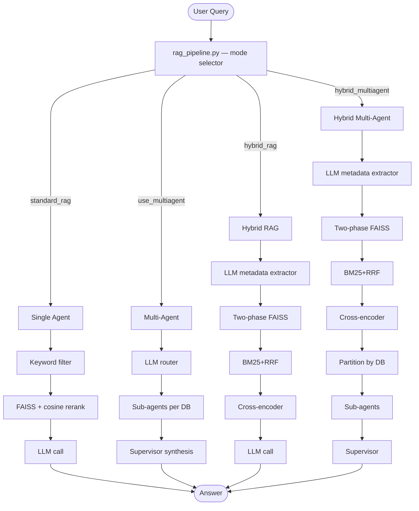

# Legal RAG System
## Architecture, Retrieval Strategies, and Evaluation

Text Mining Project — Academic Evaluation Report

---

## Outline

1. System overview and shared infrastructure
2. Four RAG agent architectures
3. System-level flow diagram
4. RAGAS evaluation framework
5. Score results across all configurations
6. Analysis and conclusions

---

## 1. System Overview

The system answers natural language queries about civil law (inheritance and divorce)
across three European jurisdictions: Italy, Estonia, and Slovenia.

**Corpus structure:**
- Legal codes (statutory text, civil code articles)
- Court decisions (case outcomes, procedural records)
- Partitioned into four FAISS indexes: `divorce_cases`, `divorce_codes`, `inheritance_cases`, `inheritance_codes`

**Evaluation dataset:**
- 10 held-out questions per domain
- Evaluated with RAGAS (context precision, context recall, faithfulness, answer relevancy, answer correctness)

---

## 2. Shared Infrastructure

| Component | Detail |
|---|---|
| Embedding | `all-MiniLM-L6-v2` (384-dim); BGE-768 after index rebuild |
| Chunking | 512 tokens / 50-token overlap |
| Vector store | FAISS, 4 indexes |
| LLM | GPT-4o-mini via OpenRouter |
| max_tokens | 768 |
| Cross-encoder | `cross-encoder/ms-marco-MiniLM-L-6-v2` |
| BM25 fusion | Reciprocal Rank Fusion (RRF, k=60) |

All architectures share this layer. They differ only in retrieval and synthesis strategy.

---

## 3a. Single Agent

One LLM. One retrieval pass. One answer generation call.

```
Query
  → keyword filter (law, country)
  → heuristic DB selection
  → FAISS retrieval (top_k=30) + cosine rerank (top_k_final=10)
  → single LLM call with concatenated context
  → Answer
```

**Strengths:** Highest answer correctness (0.695). Simple, fast, no orchestration overhead.

**Weakness:** Answer relevancy low (0.641) — the model cannot always focus its response
when the context window contains 10 heterogeneous documents.

---

## 3b. Multi-Agent

Adds an LLM router and per-database sub-agents.

```
Query
  → LLM Router: legal query (YES) or chitchat/general (NO)?
  → [NO] direct answer from parametric knowledge
  → [YES] LLM DB routing → select relevant FAISS indexes
  → Sub-agent per DB: isolated retrieval + partial answer
  → Supervisor LLM: synthesise sub-answers into final response
  → Answer
```

**Strengths:** Router prevents off-domain hallucination. Sub-agent isolation improves
faithfulness (0.805 at 10/7). Relevancy competitive at 0.820.

**Weakness:** Supervisor synthesis can lose specific factual details — answer correctness
drops to 0.627.

---

## 3c. Hybrid RAG

Replaces keyword extraction with structured LLM metadata parsing. Adds BM25+RRF and cross-encoder.

```
Query
  → LLM extracts LEGAL_METADATA_SCHEMA (law mandatory, codes/cost/duration optional)
  → heuristic DB selection (no extra LLM call)
  → two-phase FAISS: full filter → law-only fallback
  → BM25 + RRF fusion (dense rank + sparse rank combined)
  → cosine similarity rerank → cross-encoder threshold filter (logit >= 0.0)
  → single LLM call (metadata string + filtered context)
  → Answer
```

**Strengths:** Best retrieval — context precision 1.000, recall 0.867.

**Weakness:** Feeding 30 chunks to one LLM call collapses answer relevancy to 0.486.

---

## 3d. Hybrid Multi-Agent (Best Overall)

Combines Hybrid retrieval with per-DB sub-agent synthesis.

```
Query
  → [Hybrid pipeline: metadata extraction → two-phase FAISS → BM25+RRF → rerank → cross-encoder]
  → partition retrieved documents by source DB
  → sub-agent per DB partition: partial answer from isolated context
  → supervisor LLM: synthesise + inject metadata string
  → Answer
```

**Why it works:** The same large retrieved pool is distributed across sub-agents instead of
fed to one LLM in one pass. Each agent sees a focused, manageable context.

**Best config:** top_k=15, top_k_final=10 — mean score **0.784**.

---

## 4. System Flow Diagram



---

## 5. RAGAS Evaluation Metrics

| Metric | What it measures |
|---|---|
| Context Precision | Fraction of retrieved documents that are relevant |
| Context Recall | Fraction of relevant documents that were retrieved |
| Faithfulness | Fraction of answer claims grounded in retrieved context |
| Answer Relevancy | Semantic alignment between answer and question |
| Answer Correctness | Factual overlap with the ground-truth reference answer |

All metrics scored on [0, 1]. **0.80 is used as the target threshold** in this evaluation.

---

## 6. Score Results

| Architecture | Prec | Recall | Faith | Relev | Correct | Mean |
|---|:---:|:---:|:---:|:---:|:---:|:---:|
| Single Agent (30/10) | 0.800 | 0.742 | 0.780 | 0.641 | **0.695** | 0.732 |
| Multi Agent (10/7) | 0.800 | 0.733 | 0.805 | **0.820** | 0.627 | 0.757 |
| Multi Agent (30/10) | 0.800 | 0.767 | 0.653 | 0.810 | 0.628 | 0.732 |
| Hybrid (30/10) | **1.000** | **0.867** | 0.633 | 0.486 | 0.608 | 0.719 |
| **HM (15/10)** | 0.800 | 0.800 | **0.812** | **0.826** | 0.680 | **0.784** |
| HM (20/10) | 0.800 | 0.767 | 0.763 | 0.802 | 0.619 | 0.750 |
| HM (30/10) | 0.800 | 0.750 | 0.802 | 0.731 | 0.639 | 0.744 |

HM = Hybrid Multi-Agent. Bold = best per column.

---

## 7a. Finding — top_k Size Governs Faithfulness

Comparing Multi Agent at different top_k settings:

| Config | Faithfulness | Relevancy |
|---|:---:|:---:|
| Multi Agent 10/7 | **0.805** | **0.820** |
| Multi Agent 30/10 | 0.653 | 0.810 |
| Delta | +0.152 | +0.010 |

Smaller context per sub-agent = less irrelevant material = fewer hallucinated claims.
This is the strongest single hyperparameter effect in the entire evaluation.

---

## 7b. Finding — Retrieval Quality Alone Does Not Predict Answer Quality

Hybrid (30/10) achieves perfect retrieval precision (1.000) but the lowest answer relevancy (0.486).

The retrieval pipeline correctly identifies all relevant documents.
The generation bottleneck is the single-pass LLM receiving 30 chunks at once.

Hybrid Multi-Agent (15/10) uses an identical retrieval pipeline but distributes the context
across sub-agents. Answer relevancy recovers to 0.826.

**Implication:** Improving retrieval beyond a certain point yields diminishing returns unless
the generation stage can consume the retrieved evidence efficiently.

---

## 7c. Finding — Answer Correctness is Model-Bounded

Answer correctness spans only **0.608 – 0.695** across all seven configurations.
The highest value belongs to the simplest architecture (Single Agent).

This metric is less sensitive to retrieval or synthesis strategy than the other four metrics.
It is primarily bounded by:

1. The factual knowledge capacity of the underlying LLM (GPT-4o-mini).
2. The quality and specificity of the reference ground-truth answers.
3. Response length — increasing `max_tokens` from 384 to 768 reduces truncation artefacts.

---

## 8. Conclusions

**Best configuration: Hybrid Multi-Agent (15/10)** — mean score 0.784, the only architecture
exceeding 0.80 on three metrics simultaneously (faithfulness, relevancy, recall).

**Key design principles observed:**

1. Compact sub-agent context (10–15 documents) is more valuable than large context (30 documents).
2. BM25+RRF hybrid retrieval improves precision on legal text with exact article references.
3. Cross-encoder threshold filtering removes low-confidence documents before generation.
4. Structured LLM metadata extraction guides both DB routing and answer framing more precisely
   than keyword heuristics alone.
5. Answer correctness requires model-level improvements rather than pipeline-level changes.

**Recommended next step:** Rebuild vector stores with `BAAI/bge-base-en-v1.5` (768-dim)
and evaluate whether the larger semantic space further closes the gap in answer correctness.

---

*Report generated from RAGAS evaluation files in `qa/` directory.*
*Chart: `qa/scores_chart.png` | Score data: `qa/scores.csv`*
