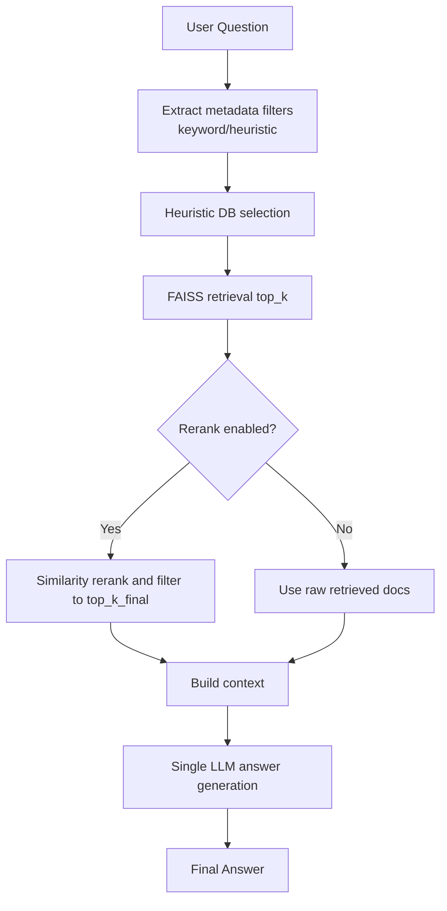
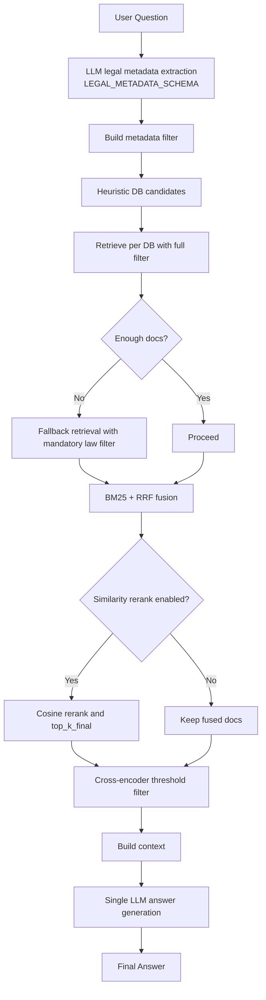
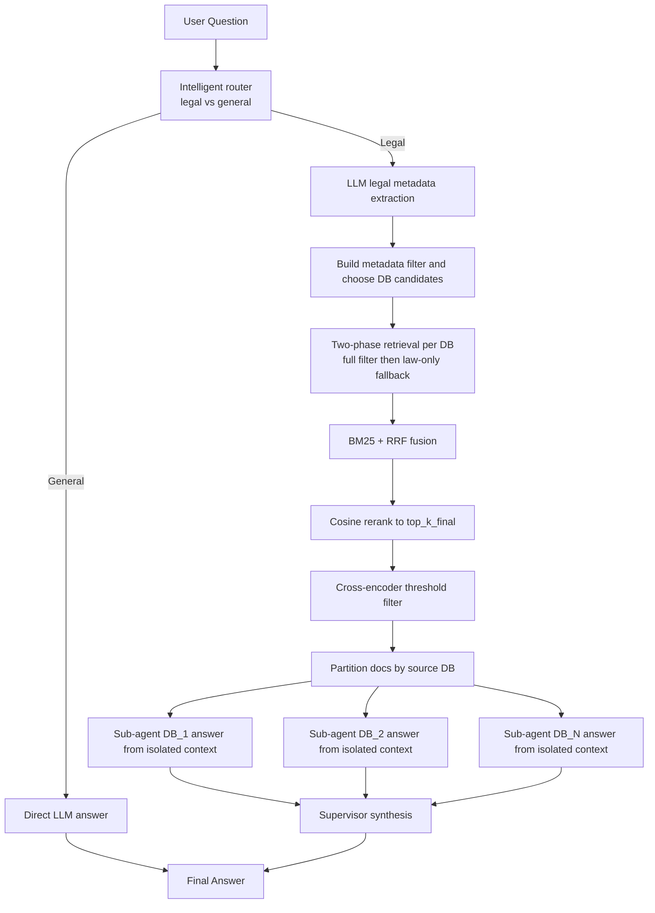

# Final Recommendation and Optimal Parameters (Based on Your Evaluated Question Set)

## 1) Best Architecture to Use

### Recommended default: **Hybrid Multi-Agent**

Based on the score table in [score/report_ragas.md](score/report_ragas.md) and [report/report.md](report/report.md), the best overall configuration is:

- **Architecture**: Hybrid Multi-Agent
- **top_k / top_k_final**: **15 / 10**
- **Mean score**: **0.784** (highest among all tested variants)

This setup is the best balance across retrieval and generation quality:
- Faithfulness: **0.812**
- Answer Relevancy: **0.826**
- Answer Correctness: **0.680**
- Context Precision: **0.800**
- Context Recall: **0.800**

### If your priority is strictly factual correctness only

- Use **Single Agent (30/10)**
- It has the highest answer_correctness (**0.695**) in your experiments, but lower relevancy/faithfulness trade-offs than Hybrid Multi-Agent (15/10).

---

## 2) Optimal Retrieval Parameters

## Recommended production profile (from tested best)

- `agentic_mode`: `hybrid_multiagent`
- `top_k`: **15**
- `top_k_final`: **10**
- `use_rerank`: **true**
- `rerank_metric`: **cosine**
- `use_bm25`: **true**
- `cross_encoder`: **enabled** (`cross-encoder/ms-marco-MiniLM-L-6-v2`)
- `cross_encoder_threshold`: **0.0**
- `similarity_threshold`: **0.45**
- `chunk_size`: **512**
- `chunk_overlap`: **50**
- `max_context_chars`: **8000**

### Why reranking should be enabled

Your best-performing architecture relies on a multi-stage ranking stack:
1. dense FAISS retrieval,
2. BM25 + RRF fusion,
3. similarity reranking,
4. cross-encoder filtering.

Disabling reranking in this architecture typically increases context noise and reduces faithfulness/relevancy.

### Why cosine metric

Cosine is already used in your strongest reported settings and is robust for normalized sentence-transformer embeddings (`normalize_embeddings=True`).

---

## 3) Evaluated Configurations Snapshot

| Architecture | top_k/final | Context Precision | Context Recall | Faithfulness | Answer Relevancy | Answer Correctness | Mean |
|---|---:|---:|---:|---:|---:|---:|---:|
| Single Agent | 30/10 | 0.800 | 0.742 | 0.780 | 0.641 | 0.695 | 0.732 |
| Multi-Agent | 30/10 | 0.800 | 0.767 | 0.653 | 0.810 | 0.628 | 0.732 |
| Hybrid (metadata+vector) | 30/10 | **1.000** | **0.867** | 0.633 | 0.486 | 0.608 | 0.719 |
| Hybrid Multi-Agent | 10/7 | 0.800 | 0.733 | 0.805 | 0.820 | 0.627 | 0.757 |
| Hybrid Multi-Agent | **15/10** | 0.800 | 0.800 | **0.812** | **0.826** | 0.680 | **0.784** |
| Hybrid Multi-Agent | 20/10 | 0.800 | 0.767 | 0.763 | 0.802 | 0.619 | 0.750 |
| Hybrid Multi-Agent | 30/10 | 0.800 | 0.750 | 0.802 | 0.731 | 0.639 | 0.744 |

Source: [score/report_ragas.md](score/report_ragas.md), [report/report.md](report/report.md)

---

## 4) Process Flow Diagrams (Mermaid)

### 4.1 Single Agent



### 4.2 Multi-Agent (Supervisor)

```mermaid
flowchart TD
    Q[User Question] --> R1[Intelligent router<br/>legal vs general]
    R1 -->|General| G1[Direct LLM answer (no retrieval)]
    G1 --> A[Final Answer]

    R1 -->|Legal| R2[Metadata extraction]
    R2 --> R3[LLM DB selection/routing]
    R3 --> R4[Spawn sub-agent per selected DB]

    R4 --> S1[Sub-agent DB_1 retrieval and answer]
    R4 --> S2[Sub-agent DB_2 retrieval and answer]
    R4 --> SN[Sub-agent DB_N retrieval and answer]

    S1 --> SUP[Supervisor synthesis]
    S2 --> SUP
    SN --> SUP

    SUP --> A
```

### 4.3 Hybrid (Metadata + Vector)



### 4.4 Hybrid Multi-Agent



---

## 5) Practical Decision Rule

Use this quick policy for deployment:

1. Start with **Hybrid Multi-Agent 15/10 + rerank ON + cosine** as default.
2. If latency/cost is too high, step down to **Single Agent 30/10**.
3. If you need best retrieval diagnostics (not best final answer), run **Hybrid 30/10** for analysis mode.
4. Keep cross-encoder filter ON (threshold 0.0) to suppress low-relevance passages.

---

## 6) Notes from Current Question Set Behavior

From your shared chat set, several failures were linked to cross-country citation mismatches and off-target source selection. The recommended Hybrid Multi-Agent profile helps reduce this by:
- isolating DB-specific reasoning,
- forcing supervisor reconciliation,
- and using stronger reranking/filtering before generation.

Still, for maximum legal reliability, keep manual review for high-stakes answers.
