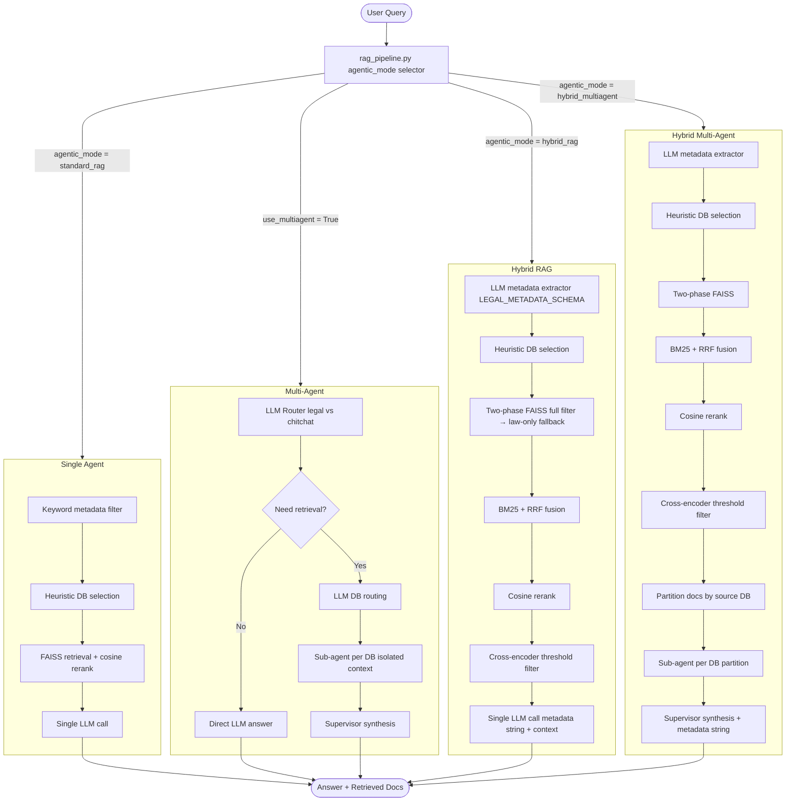

```mermaid
flowchart TD
    Q([User Query]) --> RP[rag_pipeline.py agentic_mode selector]

    RP -->|agentic_mode = standard_rag| SA
    RP -->|use_multiagent = True| MA
    RP -->|agentic_mode = hybrid_rag| HY
    RP -->|agentic_mode = hybrid_multiagent| HM

    subgraph SA [Single Agent]
        SA1[Keyword metadata filter] --> SA2[Heuristic DB selection]
        SA2 --> SA3[FAISS retrieval + cosine rerank]
        SA3 --> SA4[Single LLM call]
    end

    subgraph MA [Multi-Agent]
        MA1[LLM Router legal vs chitchat] --> MA2{Need retrieval?}
        MA2 -->|No| MA3[Direct LLM answer]
        MA2 -->|Yes| MA4[LLM DB routing]
        MA4 --> MA5[Sub-agent per DB isolated context]
        MA5 --> MA6[Supervisor synthesis]
    end

    subgraph HY [Hybrid RAG]
        HY1[LLM metadata extractor LEGAL_METADATA_SCHEMA] --> HY2[Heuristic DB selection]
        HY2 --> HY3[Two-phase FAISS full filter → law-only fallback]
        HY3 --> HY4[BM25 + RRF fusion]
        HY4 --> HY5[Cosine rerank]
        HY5 --> HY6[Cross-encoder threshold filter]
        HY6 --> HY7[Single LLM call metadata string + context]
    end

    subgraph HM [Hybrid Multi-Agent]
        HM1[LLM metadata extractor] --> HM2[Heuristic DB selection]
        HM2 --> HM3[Two-phase FAISS]
        HM3 --> HM4[BM25 + RRF fusion]
        HM4 --> HM5[Cosine rerank]
        HM5 --> HM6[Cross-encoder threshold filter]
        HM6 --> HM7[Partition docs by source DB]
        HM7 --> HM8[Sub-agent per DB partition]
        HM8 --> HM9[Supervisor synthesis + metadata string]
    end

    SA4 --> ANS([Answer + Retrieved Docs])
    MA3 --> ANS
    MA6 --> ANS
    HY7 --> ANS
    HM9 --> ANS
```